# 1. Guvi ReactJS E-commerce App Deployment

## Deployment Guide

### Prerequisites

- [GitHub Profile](https://github.com/christine-robinson)
  
  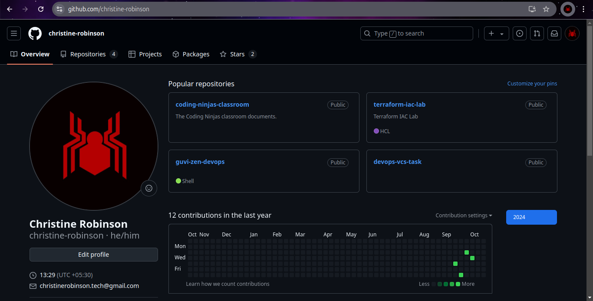

- [DockerHub Profile](https://hub.docker.com/repositories/christinerobinson101)

  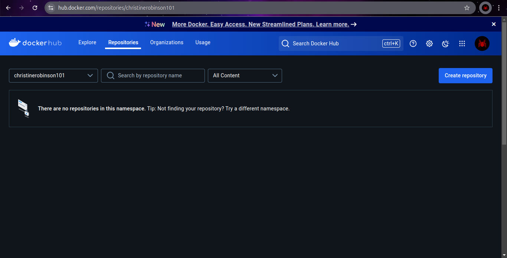

- [AWS Console](https://ap-south-1.console.aws.amazon.com/console/home?region=ap-south-1#)

  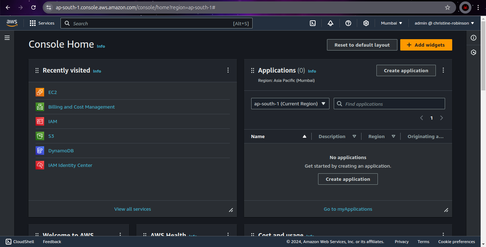

### Deployment Steps

#### 1. Clone the Application

**Step 1:** ***Fork*** the given [application source code](https://github.com/sriram-R-krishnan/devops-build) repository in the name of ***guvi-p1-reactjs-ecommerce-app***

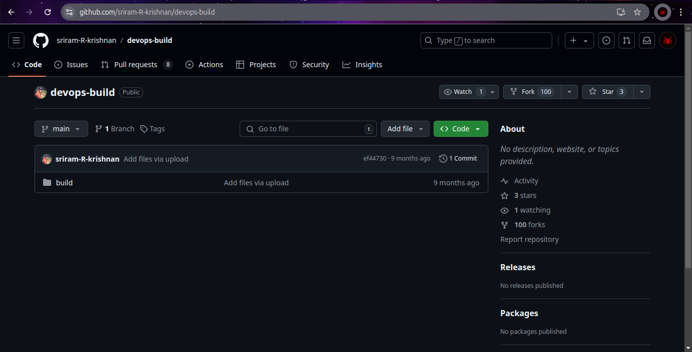

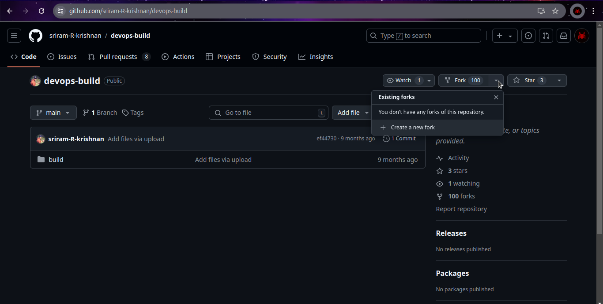

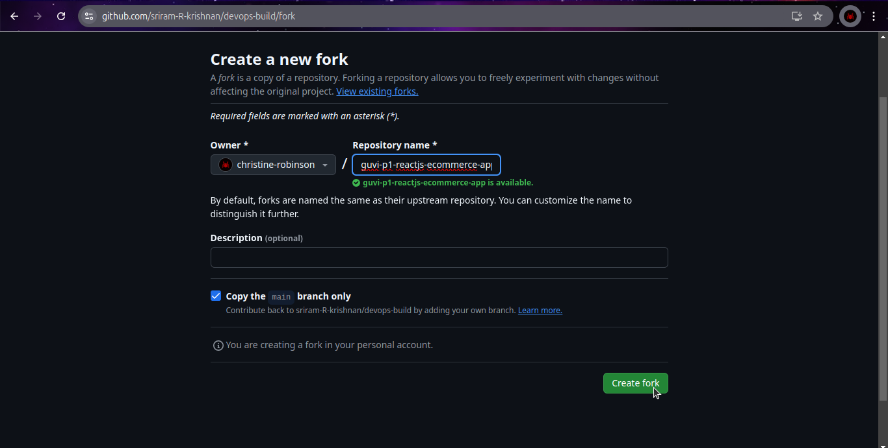

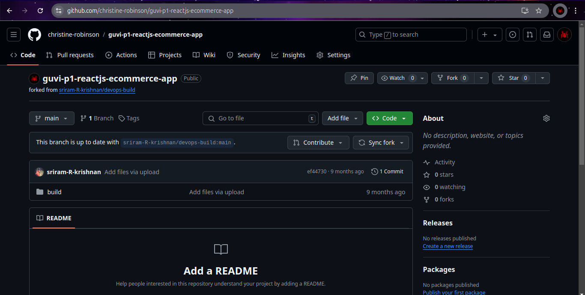

**Step 2:** ***Clone*** the [guvi-p1-reactjs-ecommerce-app](https://github.com/christine-robinson/guvi-p1-reactjs-ecommerce-app) repository

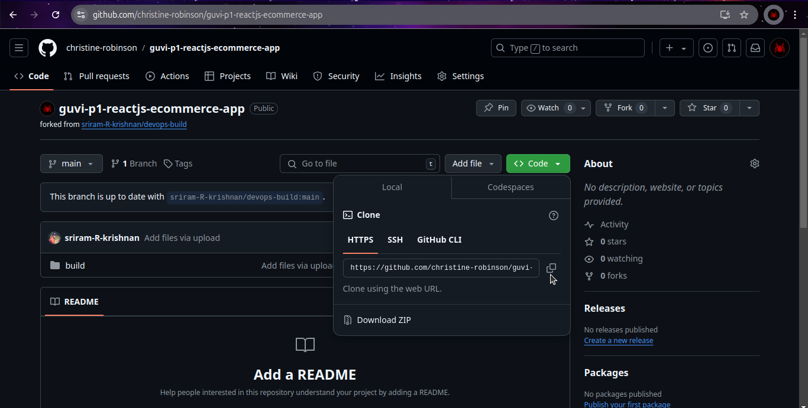

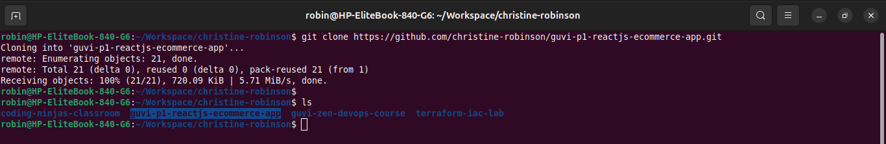

**Step 3:** Open the project folder with ***VS Code***

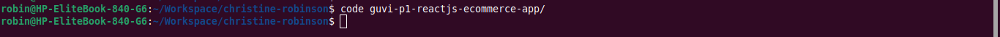

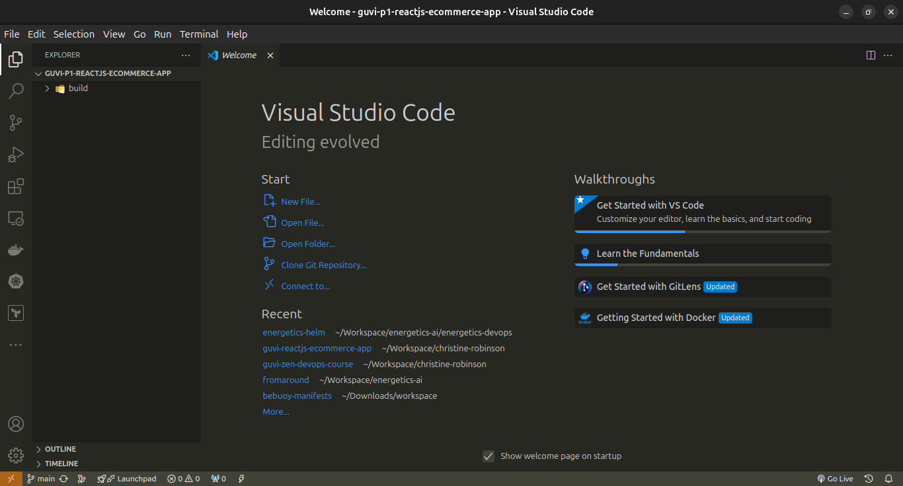

#### 2. Dockerize the Application

**Step 1:** Create 2 repositories in ***DockerHub*** with the following names, ***guvi-p1-dev-reactjs-ecommerce-app*** & ***guvi-p1-prod-reactjs-ecommerce-app***

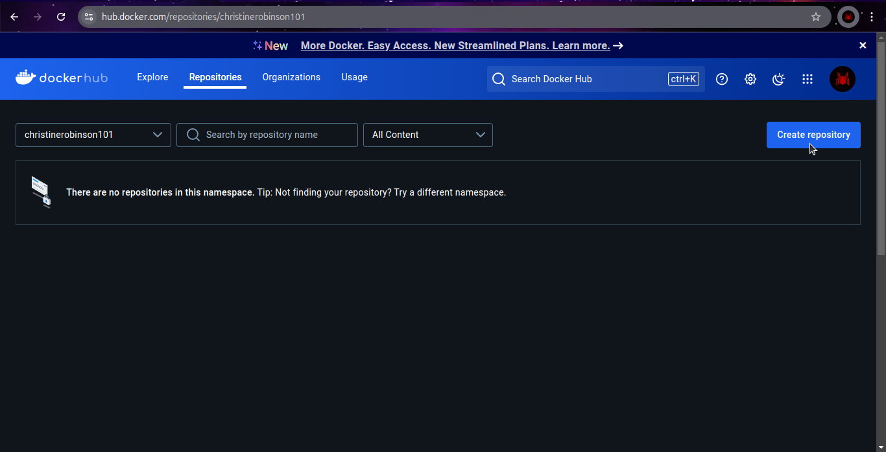

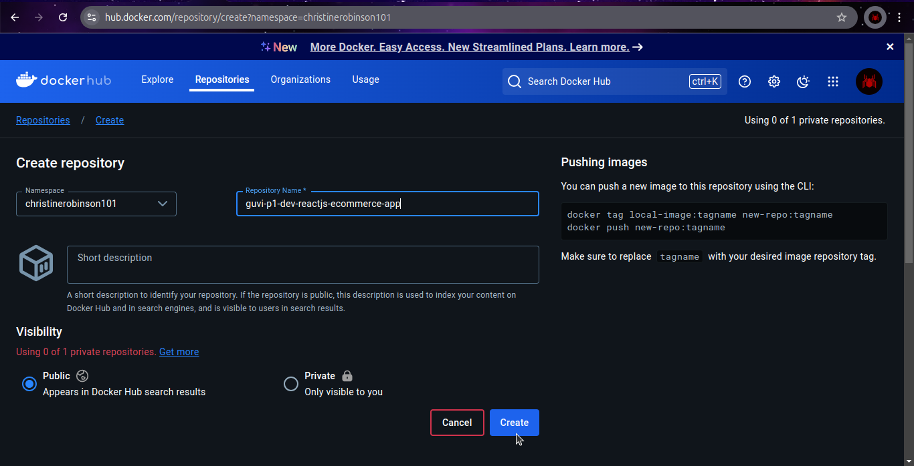

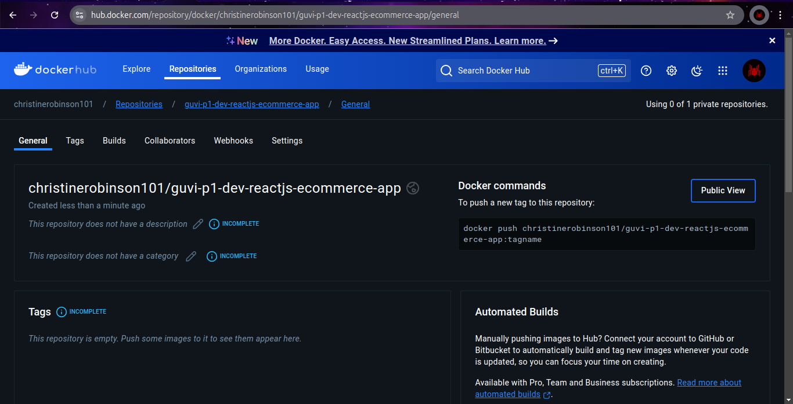

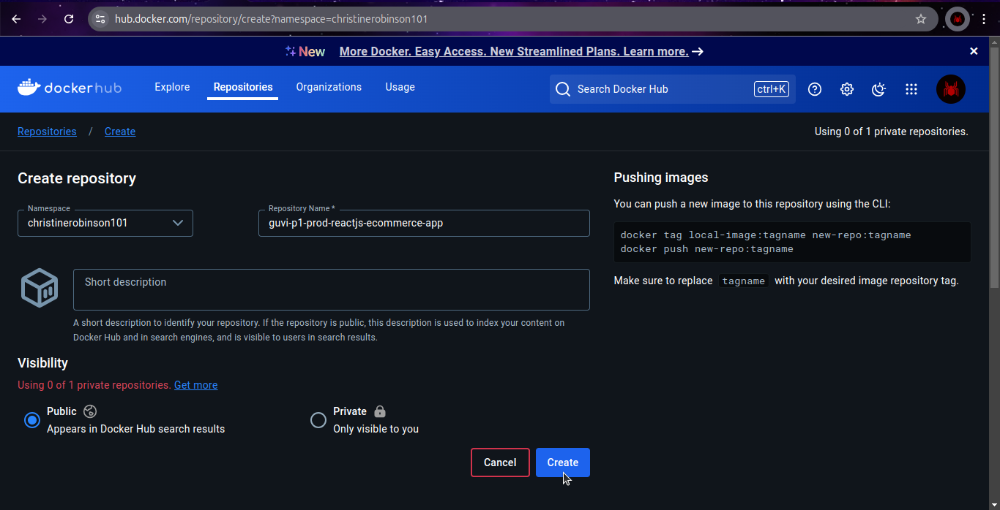

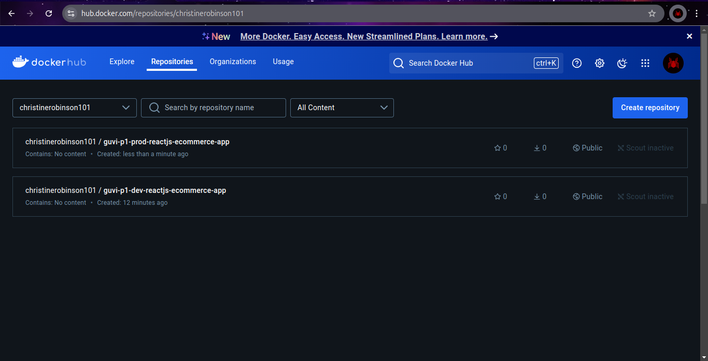

**Step 2:** Create a ***Personal Access Token*** in the name of ***guvi-p1*** for authorization

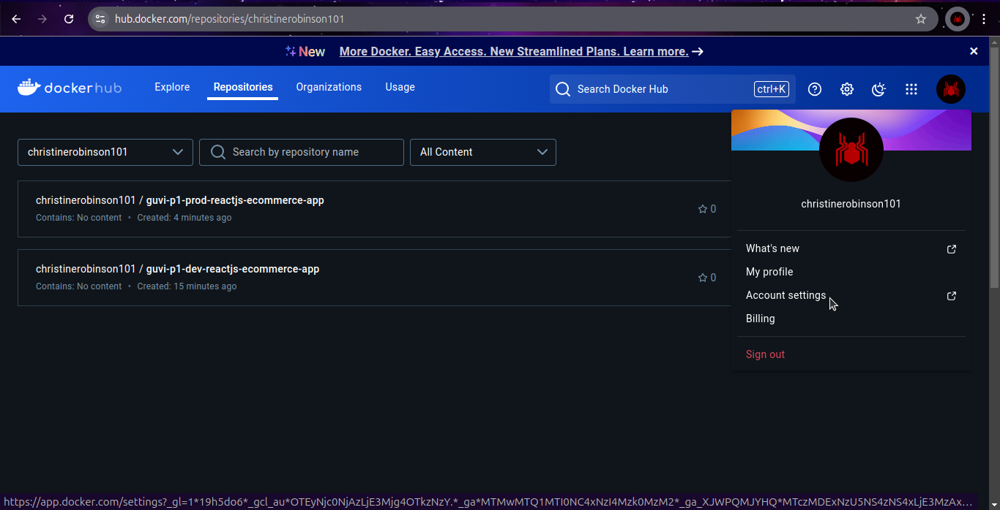

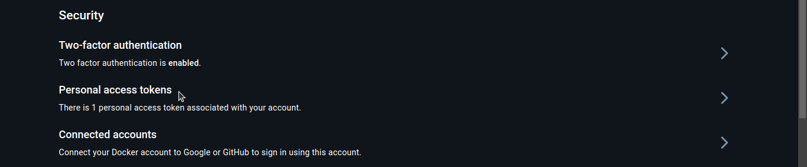

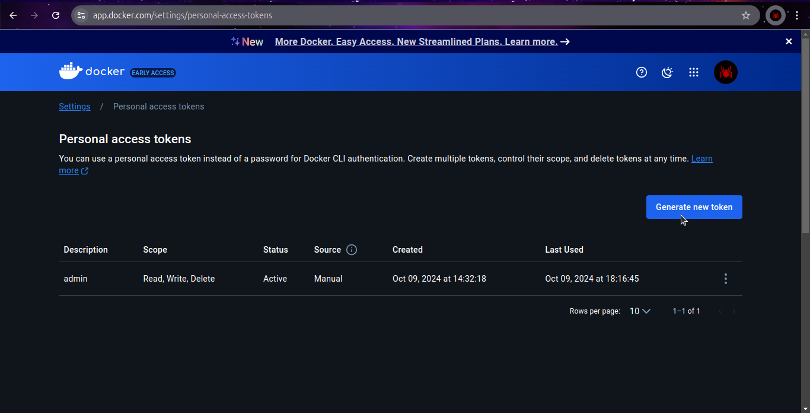

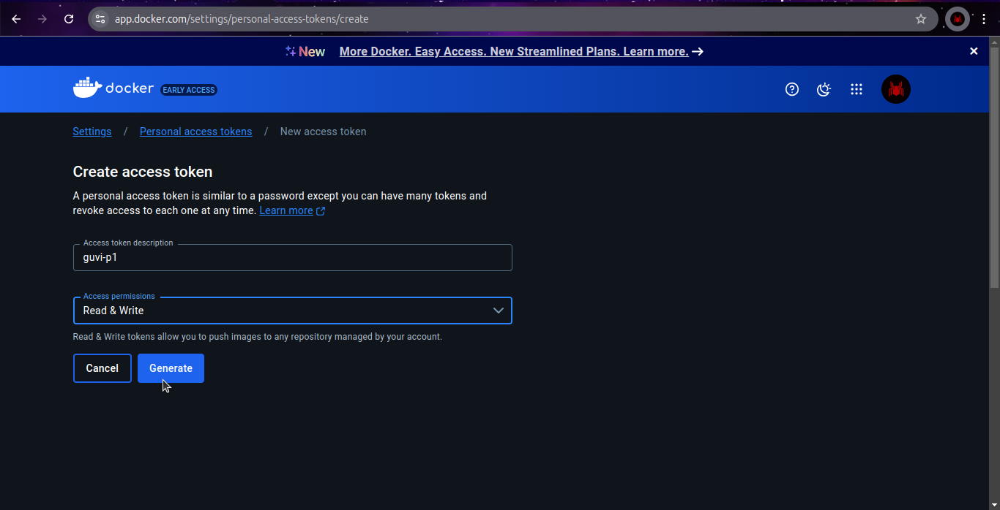

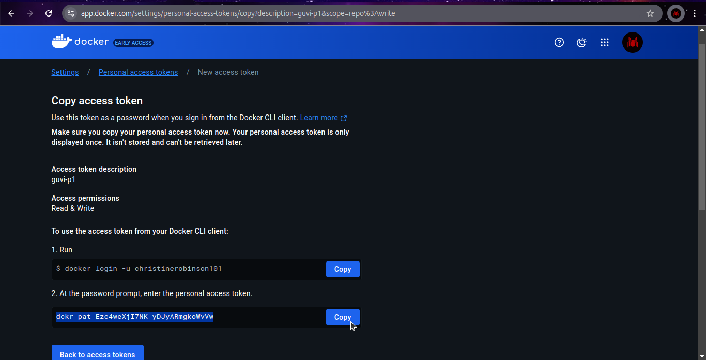
