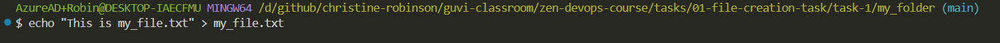
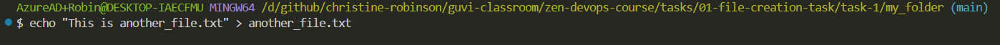
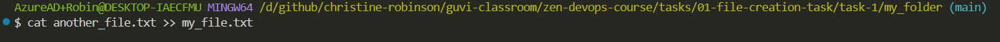
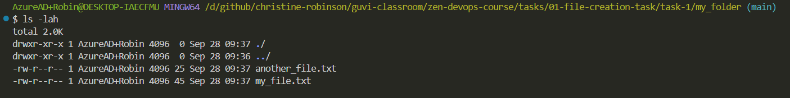

# 1. File Creation Task

## Task 1: Instructions

**Step 1:** Create a directory called ***my_folder***.

```bash
mkdir my_folder
```


**Step 2:** Navigate into ***my_folder***.

```bash
cd my_folder
```


**Step 3:** Create a file named ***my_file.txt*** with some text.

```bash
echo "This is my_file.txt" > my_file.txt
```



**Step 4:** Create another file named ***another_file.txt*** with some text.

```bash
echo "This is another_file.txt" > another_file.txt
```



**Step 5:** Concatenate the content of ***another_file.txt*** to ***my_file.txt*** and display the updated content.

```bash
cat another_file.txt >> my_file.txt
```



**Step 6:** List all files and directories in the current directory.

```bash
ls -lah
```


