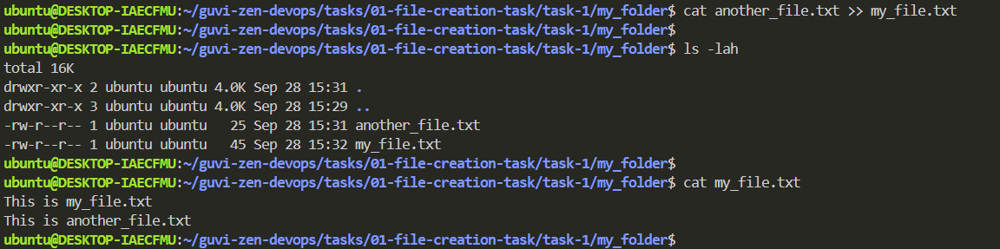

# 1. File Creation Task

## Task 1: Instructions

**Step 1:** Create a directory called ***"my_folder"***.

```bash
# Create "my_folder" directory
mkdir my_folder

# list all files
ls -lah
```


**Step 2:** Navigate into ***"my_folder"***.

```bash
# change current position to "my_folder" directory
cd my_folder

# list all files
ls -lah
```


**Step 3:** Create a file named ***"my_file.txt"*** with some text.

```bash
# Create "my_file.txt"
echo "This is my_file.txt" > my_file.txt

# list all files
ls -lah

# print the content in "my_file.txt"
cat my_file.txt
```


**Step 4:** Create another file named ***"another_file.txt"*** with some text.

```bash
# Create "another_file.txt"
echo "This is another_file.txt" > another_file.txt

# list all files
ls -lah

# print the content in "another_file.txt"
cat another_file.txt
```


**Step 5:** Concatenate the content of ***"another_file.txt"*** to ***"my_file.txt"*** and display the updated content.

```bash
# Concatenate the content of "another_file.txt" to "my_file.txt"
cat another_file.txt >> my_file.txt

# list all files
ls -lah

# print the content in "my_file.txt"
cat my_file.txt
```



**Step 6:** List all files and directories in the current directory.

```bash
# list all files
ls -lah
```


