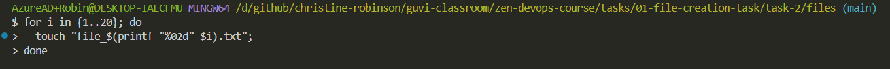
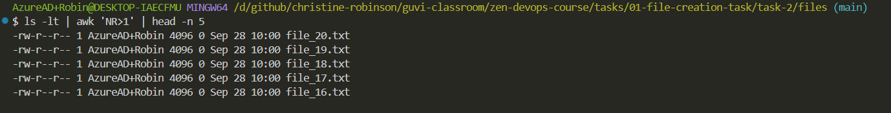

# 1. File Creation Task

## Task 2: Instructions

**Step 1:** Create 20 files with ***".txt"*** extension.

```bash
for i in {1..20}; do 
  touch "file_$(printf "%02d" $i).txt"; 
done
```


**Step 2:** Rename the first 5 files to ***".yml"*** extension.

```bash
for i in {1..5}; do 
  mv "file_$(printf "%02d" $i).txt" "file_$(printf "%02d" $i).yml"; 
done
```



***Step 3:*** Print the latest created top 5 files among the total no of files.

```bash
ls -lt | awk 'NR>1' | head -n 5
```


