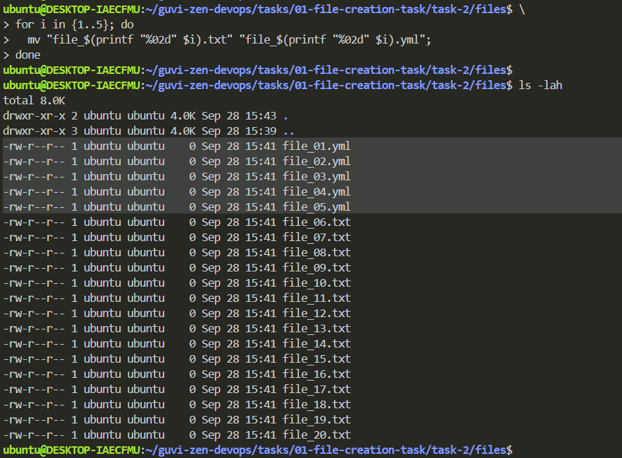

# 1. File Creation Task

## Task 2: Instructions

**Step 1:** Create 20 files with ***".txt"*** extension.

```bash
# Create 20 files with ".txt" extension
for i in {1..20}; do 
  touch "file_$(printf "%02d" $i).txt"; 
done

# list all files
ls -lah
```


**Step 2:** Rename the first 5 files to ***".yml"*** extension.

```bash
# Rename the first 5 files to ".yml" extension
for i in {1..5}; do 
  mv "file_$(printf "%02d" $i).txt" "file_$(printf "%02d" $i).yml"; 
done

# list all files
ls -lah
```



***Step 3:*** Print the latest created top 5 files among the total no of files.

```bash
# print the latest created top 5 files
ls -t | head -n 5
```


