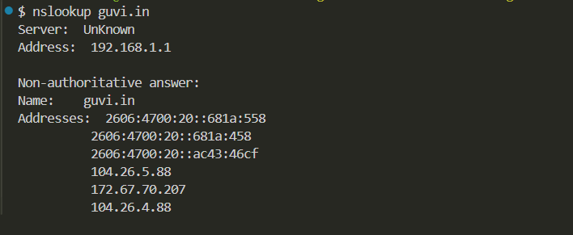
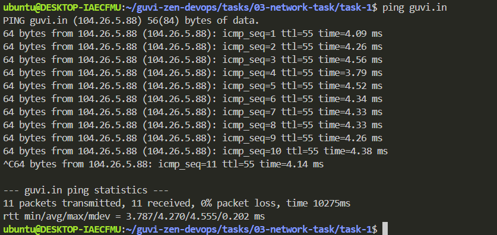

# 3. Network Task

## Task 1: Instructions

**Step 1:** Get the IP address of ***guvi.in***

```bash
nslookup guvi.in
```



**Step 2:** Find ***CPU & Memory*** usage of a server.

```bash
top -n 1
```


**Step 3:** Test the connectivity between 2 nodes.

```bash
ping guvi.in
```


