# 5. VCS Task

## Task 1: Instructions

**Step 1:** Create a new directory. Populate it with script files.

```bash
# Create Directory
mkdir devops-vcs-task

# List all files and directories
ls -lah
```

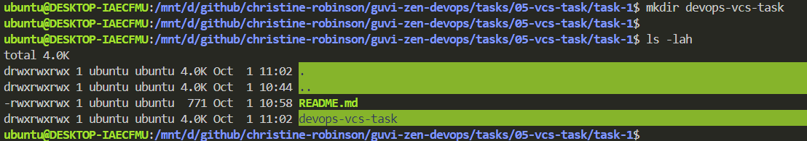

```bash
# Get into the newly created directory
cd devops-vcs-task

# Create new script files
for i in {1..5}; do 
  touch "script_$(printf "%02d" $i).sh"; 
done

# List all files
ls -lah
```


**Step 2:** Initiate an empty repository on GitHub.

- Goto [GitHub](https://github.com) Website.

- Click ***"New"*** to create new repository.
  
  

- Give a name for the repository.

  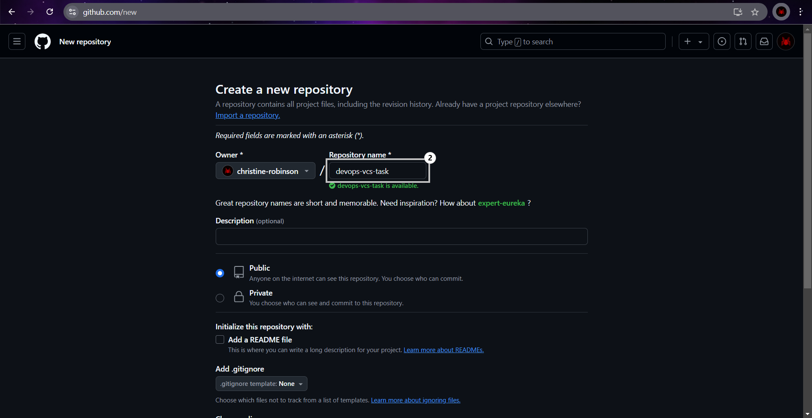

- Click on ***"Create repository"*** button to create the repository.

  

- Finally the repository has been created successfully.

  

**Step 3:** Convert the local directory into a Git repository and link it to GitHub for pushing the code into the repository.

- Follow the following commands to convert the local repository into git repository

  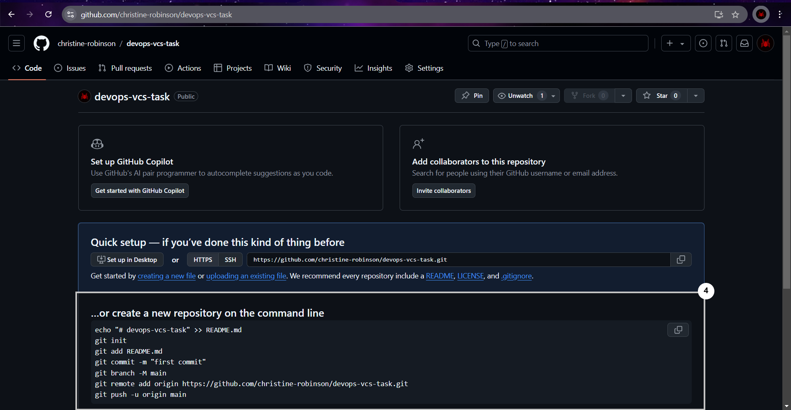

  ```bash
  echo "# devops-vcs-task" >> README.md

  git init

  git add README.md

  git commit -m "first commit"

  git branch -M main

  git remote add origin https://github.com/christine-robinson/devops-vcs-task.git

  git push -u origin main
  ```

  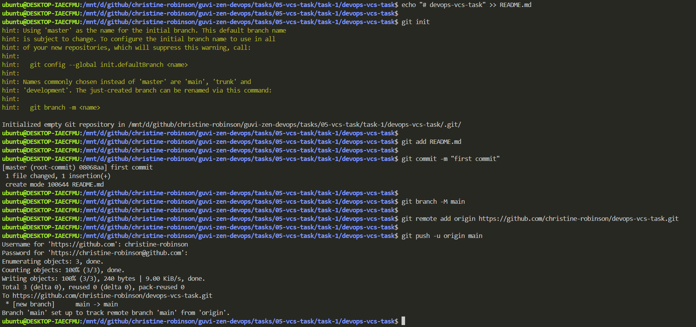

- Published ***"first commit"***

  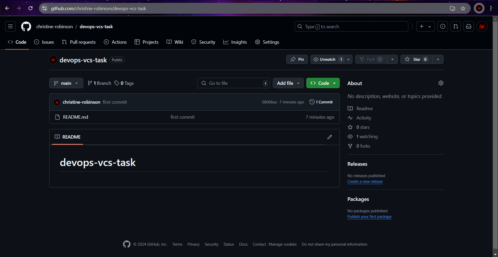

**Step 4:** Perform merge, rebase, stash commands in that git repository.

> ***Note :*** To perform merge we need one more branch.

```bash
# Create a new branch from "main" branch and switch to it.
git checkout -b scripts

# Print current branch
git branch

git status
```

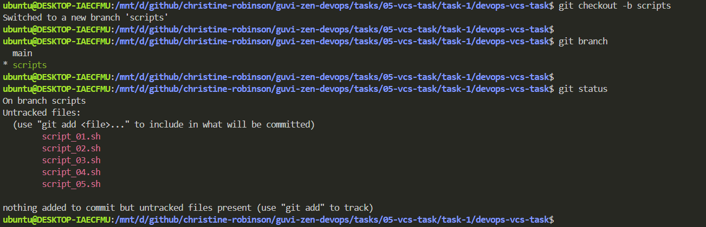

```bash
# Make a new commit
git add .

git commit -m "script files added"

# Publish new branch "scripts"
git push --set-upstream origin scripts
```

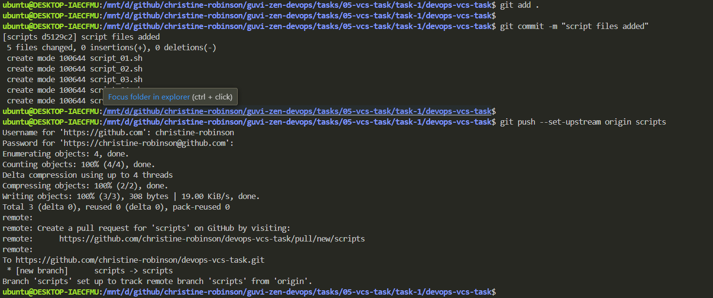

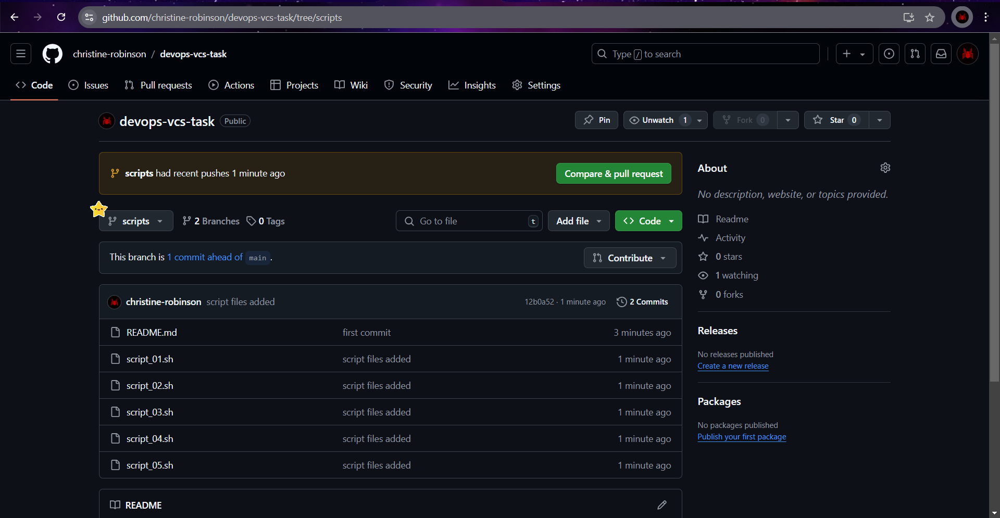

```bash
# Switch to "main" branch
git checkout main

# Print current branch
git branch

# Perform merge
git merge scripts

# Print git commit logs to verify merge
git log

# Publish the merge commit
git push
```

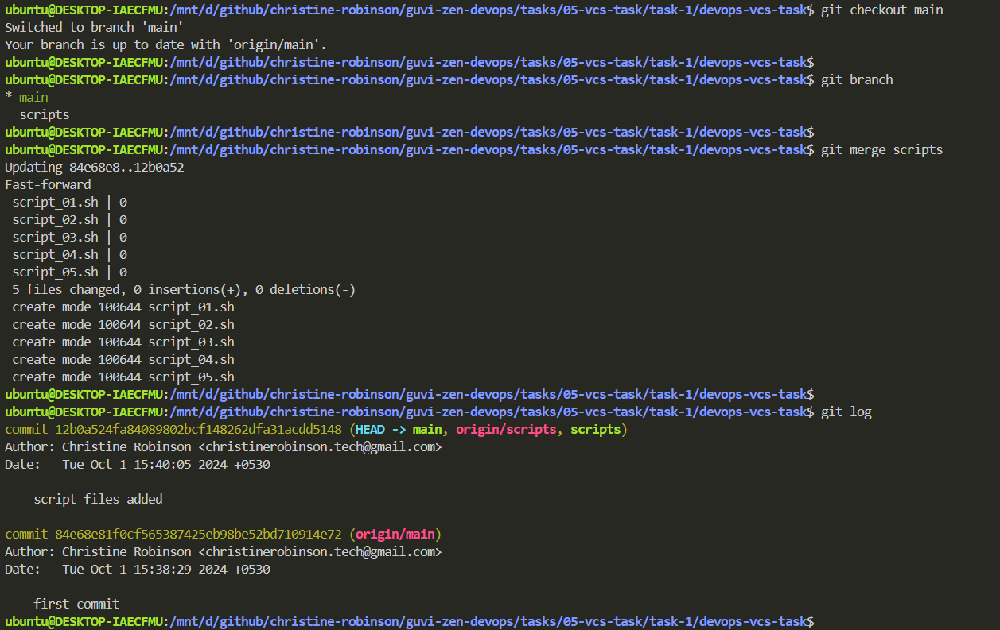

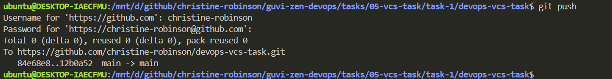

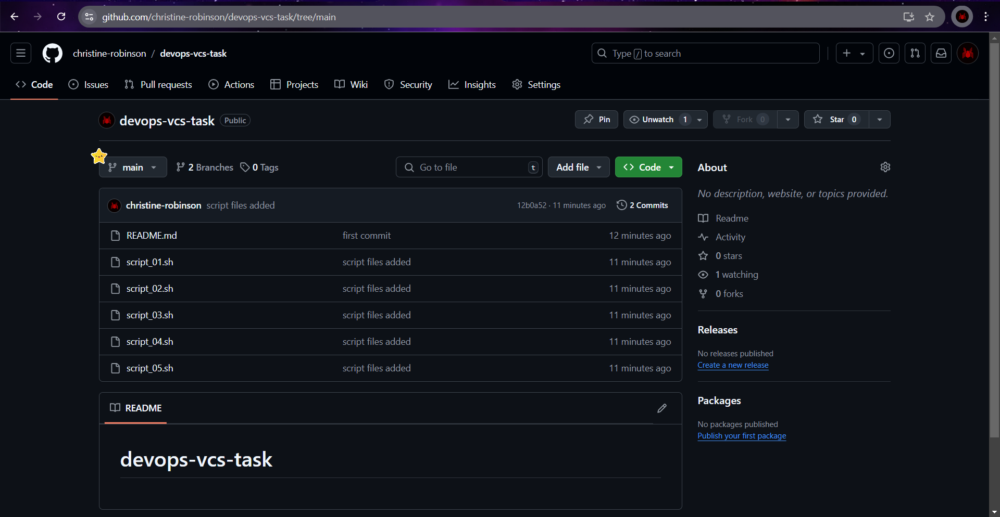

```bash
# Print current branch
git branch

# Create new script
touch script_06.sh

git status
```

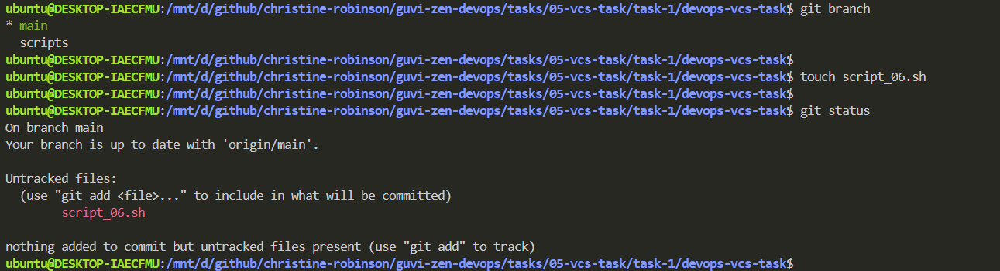

```bash
# Make a new commit
git add script_06.sh

git commit -m "script 6 added"

git push
```


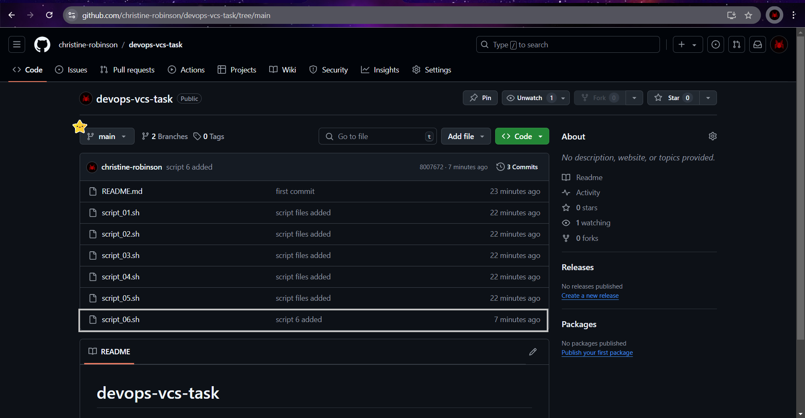

```bash
# Switch to "scripts" branch
git checkout scripts

# Perform rebase
git rebase main

# Print git commit logs to verify rebase
git log

# Publish the rebase commit
git push
```

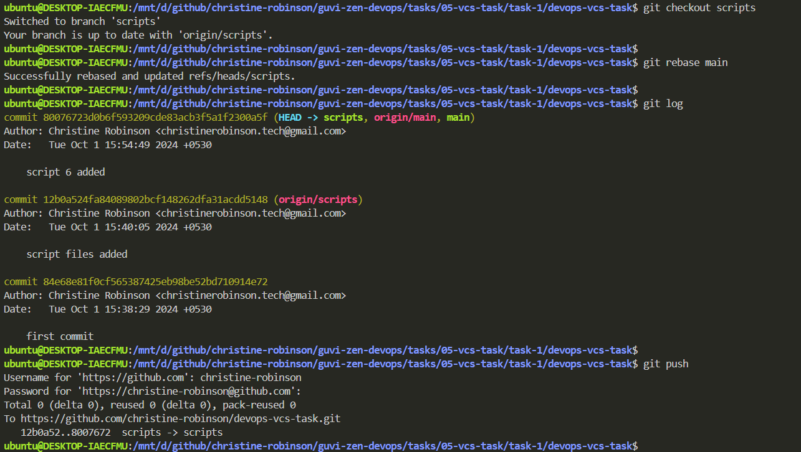


```bash
# Print current branch
git branch

# Create new script
touch script_07.sh

git status

git add script_07.sh

# Perform stash
git stash
```


```bash
# Switch to "main" branch
git checkout main

git stash list

git stash apply

git stash drop

git status
```


```bash
# Make a new commit
git commit -m "script 7 added"

git push
```


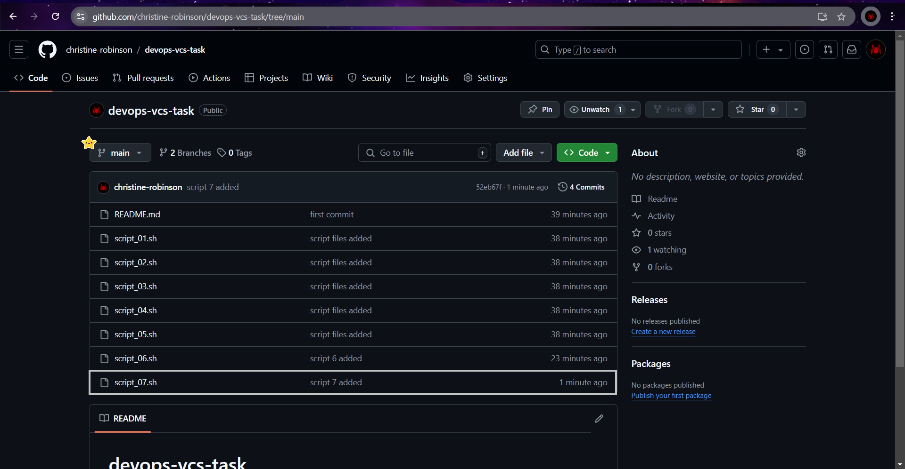
