# 6. Docker Task

## Task 1: Instructions

**Step 1:** Launch an EC2 Instance.

<<<<<<< HEAD

=======
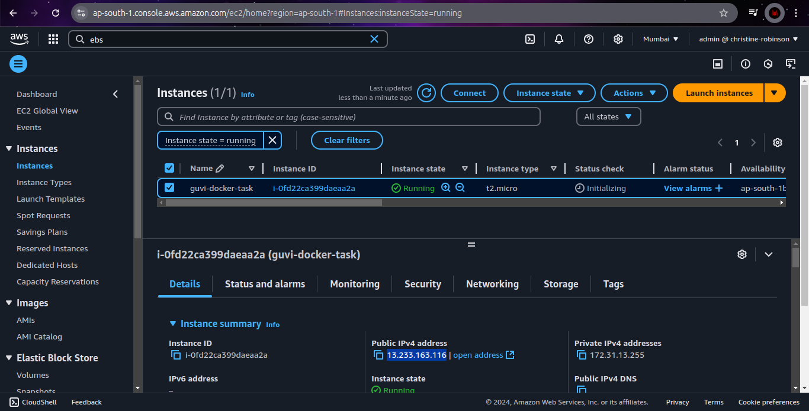
>>>>>>> 1980408 (06 Docker task completed)

**Step 2:** Install Docker Engine on the EC2 Instance.

> ***Ref:*** [https://docs.docker.com/engine/install/ubuntu/#install-using-the-repository](https://docs.docker.com/engine/install/ubuntu/#install-using-the-repository)

```bash
# Add Docker's official GPG key:
sudo apt-get update
sudo apt-get install -y ca-certificates curl
sudo install -m 0755 -d /etc/apt/keyrings
sudo curl -fsSL https://download.docker.com/linux/ubuntu/gpg -o /etc/apt/keyrings/docker.asc
sudo chmod a+r /etc/apt/keyrings/docker.asc

# Add the repository to Apt sources:
echo \
  deb [arch=$(dpkg --print-architecture) signed-by=/etc/apt/keyrings/docker.asc] https://download.docker.com/linux/ubuntu \
  $(. /etc/os-release && echo $VERSION_CODENAME) stable | \
  sudo tee /etc/apt/sources.list.d/docker.list > /dev/null

sudo apt-get update

# Install the Docker packages
sudo apt-get install -y docker-ce docker-ce-cli containerd.io docker-buildx-plugin docker-compose-plugin

# Add the current user to the docker group, so you can run Docker commands without sudo.
sudo usermod -aG docker $USER

# Reboot the instance
sudo reboot
```

**Step 3:** Verify the Installation.

```bash
# Verify the installation 
docker run hello-world
```

<<<<<<< HEAD

=======

>>>>>>> 1980408 (06 Docker task completed)

**Step 4:** Explore Docker Commands.

***Docker Images Commands***

```bash
# Pull an image from Docker Hub (e.g., nginx)
docker pull nginx

# List Docker images
docker images

# Remove a Docker image
docker rmi nginx
```

<<<<<<< HEAD
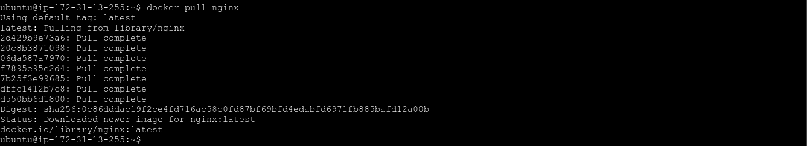


=======


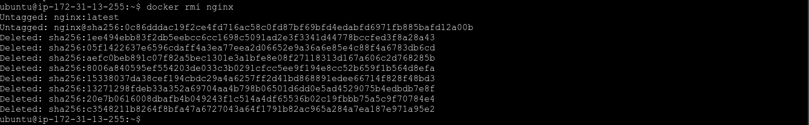
>>>>>>> 1980408 (06 Docker task completed)

***Docker Containers Commands***

```bash
# Run a Docker container (e.g., Nginx)
docker run -d --name web -p 8080:80 nginx

# List running containers
docker ps

# Check logs of a container
docker logs web

# Stop a container
docker stop web

# Remove a container
docker rm web
```

<<<<<<< HEAD

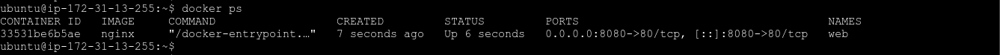


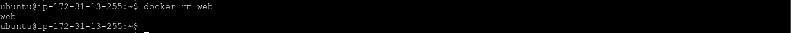
=======
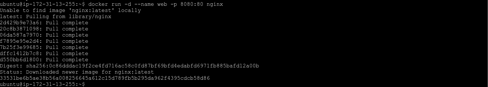


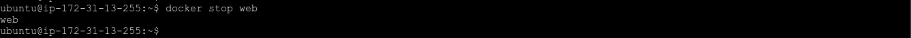

>>>>>>> 1980408 (06 Docker task completed)

***Running and Interacting with Containers***

```bash
# Run an Ubuntu container in interactive mode
docker run --name web -it nginx /bin/bash

# Check the nginx version
nginx -v

# exit from the interactive mode
exit

# Remove a container
docker rm web
```

<<<<<<< HEAD
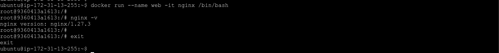
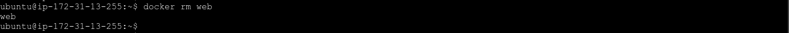
=======


>>>>>>> 1980408 (06 Docker task completed)

```bash
# To interact with a running container,
# Run a Docker container in detached mode
docker run -d --name web nginx

# Access the running container
docker exec -it web /bin/bash

# Check the nginx version
nginx -v

# exit from the interactive mode
exit

# Stop and remove a container
docker stop web
docker rm web
```

<<<<<<< HEAD
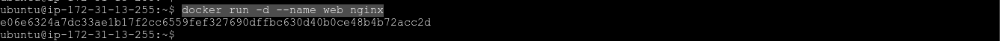
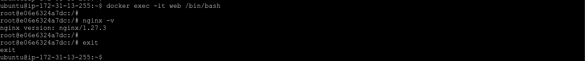

=======


>>>>>>> 1980408 (06 Docker task completed)

***Docker Volumes Commands***

```bash
# Method 1: Mount a local directory to a container
docker run -d -v /home/ubuntu/data:/data --name web nginx

# Create a file inside the running container
docker exec -it web touch /data/test_file.txt

# Check the file in the mounted path
ls -l /home/ubuntu/data

# Stop and remove a container
docker stop web
docker rm web
```

<<<<<<< HEAD
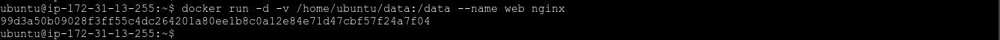

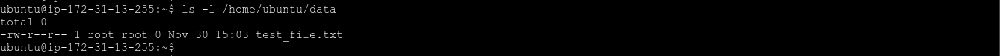

=======
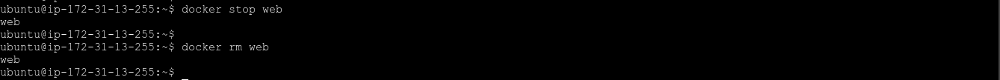

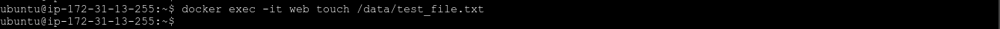

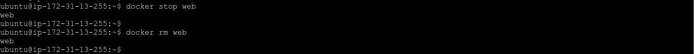
>>>>>>> 1980408 (06 Docker task completed)

```bash
# Method 2: Create a Docker volume
docker volume create nginx-volume

# List Docker volumes
docker volume ls

# Inspect volume details
docker volume inspect nginx-volume

# Run a container with a volume
docker run -d --name web -v nginx-volume:/data nginx

# Stop and remove a container
docker stop web
docker rm web

# Remove a Docker volume
docker volume rm nginx-volume
```

<<<<<<< HEAD
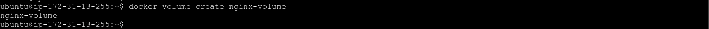
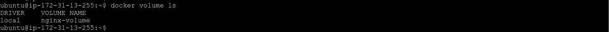
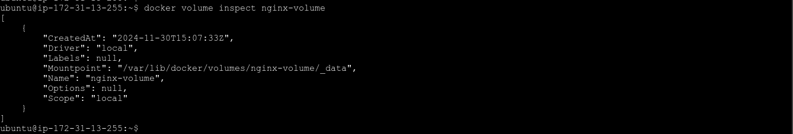

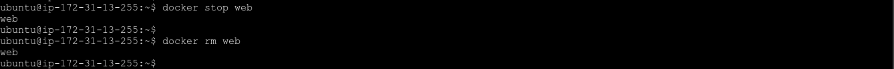
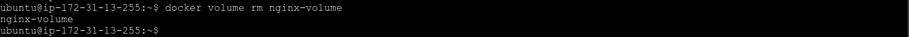
=======


>>>>>>> 1980408 (06 Docker task completed)

***Docker Network Commands***

```bash
# Create a Docker network
docker network create nginx-network

# List Docker networks
docker network ls

# Inspect network details
docker network inspect nginx-network

# Run two containers on the same network
docker run -d --name web --network nginx-network nginx
docker run -d --name db --network nginx-network -e MYSQL_ROOT_PASSWORD=root mysql

# Check db connection within the web container
docker exec -it web /bin/bash
<<<<<<< HEAD

# Install mysql client inside web container
apt-get update && apt-get install -y default-mysql-client

# Connect to db
mysql -h db -u root -p
# Enter the password - "root"

# Quit from mysql connection
=======
apt-get update && apt-get install -y default-mysql-client
mysql -h db -u root -p

# Enter password as value of "MYSQL_ROOT_PASSWORD"

# Exit from db connection
>>>>>>> 1980408 (06 Docker task completed)
exit

# Exit from container
exit

# Stop and remove containers
docker stop web db
docker rm web db

# Remove a Docker network
docker network rm nginx-network
```

<<<<<<< HEAD
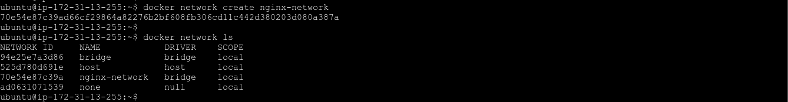

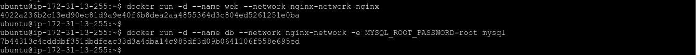


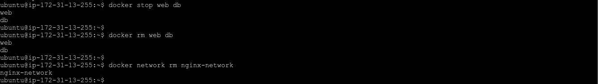
=======


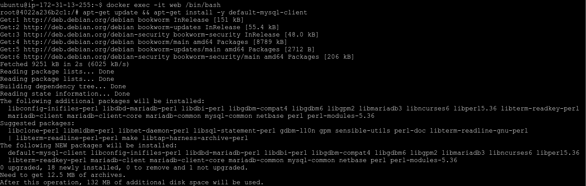
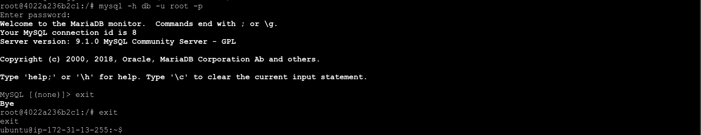

>>>>>>> 1980408 (06 Docker task completed)
