# 9. Jenkins Task #

## Instructions ##

### 1. Launch an EC2 instance and open port 8080 in its security group ###

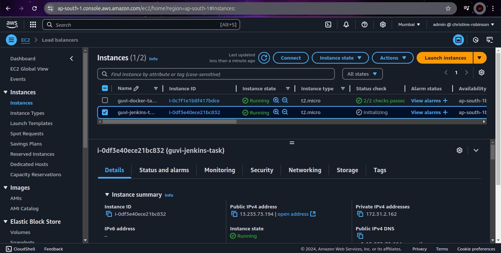

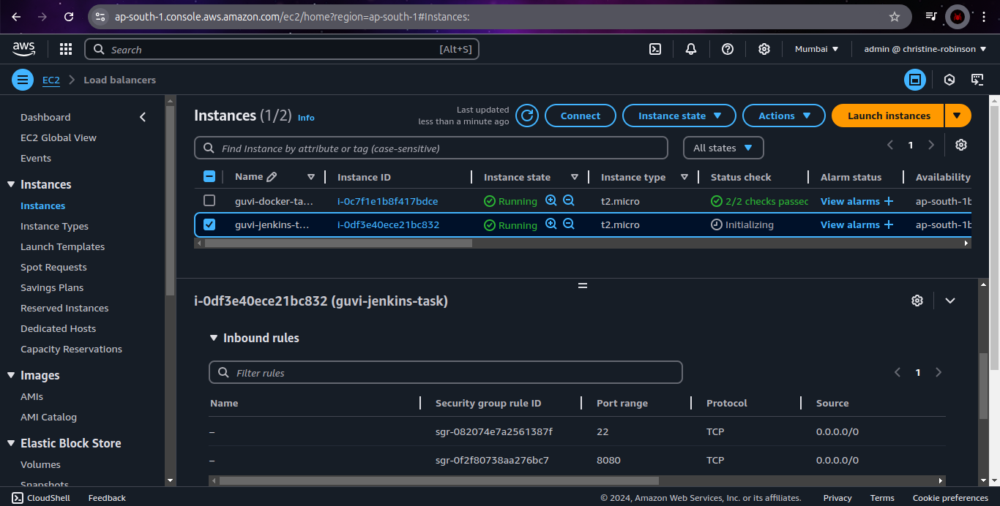

### 2. Jenkins Installation on Ubuntu ###

> Ref: [https://www.jenkins.io/doc/book/installing/linux/#installation-of-java](https://www.jenkins.io/doc/book/installing/linux/#installation-of-java)

```bash
sudo apt update

sudo apt install -y fontconfig openjdk-17-jre

java -version
```


> Ref: [https://www.jenkins.io/doc/book/installing/linux/#debianubuntu](https://www.jenkins.io/doc/book/installing/linux/#debianubuntu)

```bash
sudo wget -O /usr/share/keyrings/jenkins-keyring.asc \
  https://pkg.jenkins.io/debian-stable/jenkins.io-2023.key

echo "deb [signed-by=/usr/share/keyrings/jenkins-keyring.asc]" \
  https://pkg.jenkins.io/debian-stable binary/ | sudo tee \
  /etc/apt/sources.list.d/jenkins.list > /dev/null

sudo apt-get update

sudo apt-get install -y jenkins
```

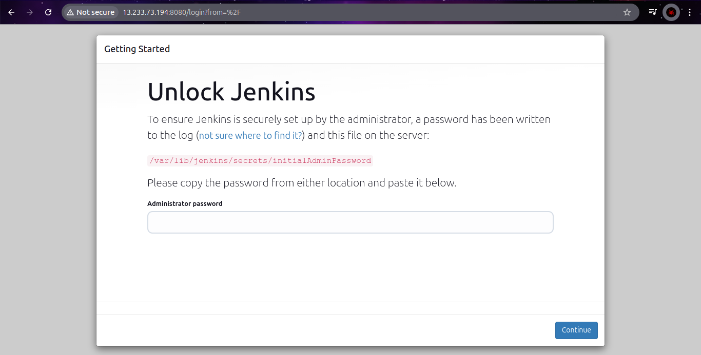

```bash
sudo cat /var/lib/jenkins/secrets/initialAdminPassword
```

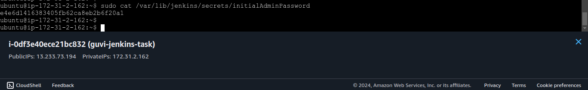

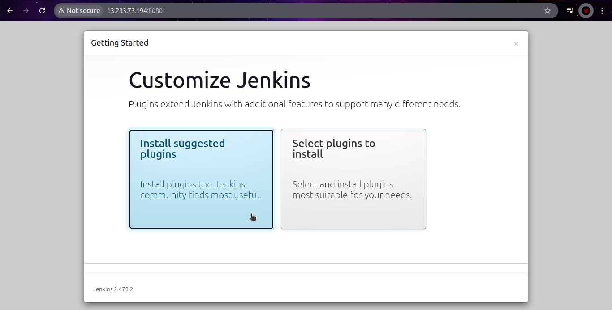

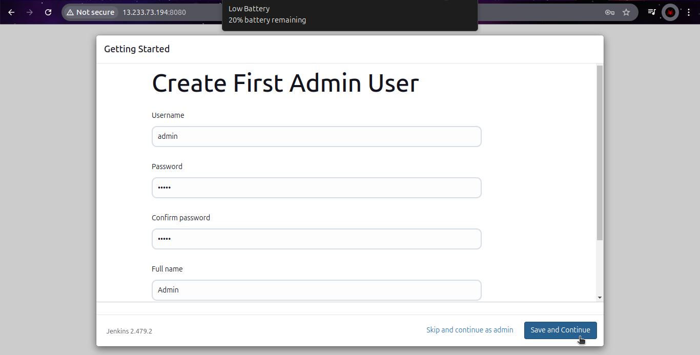

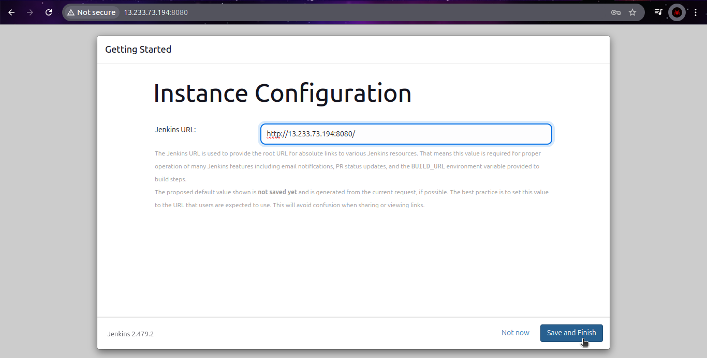

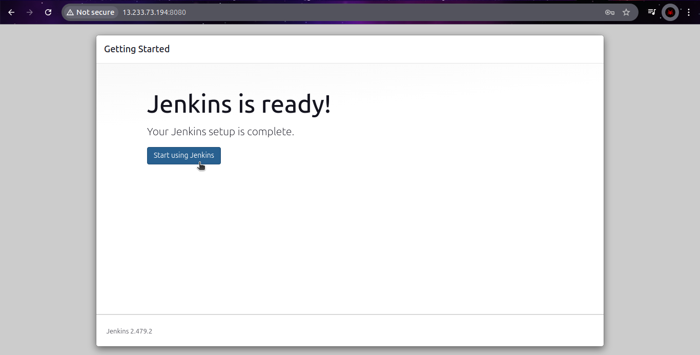

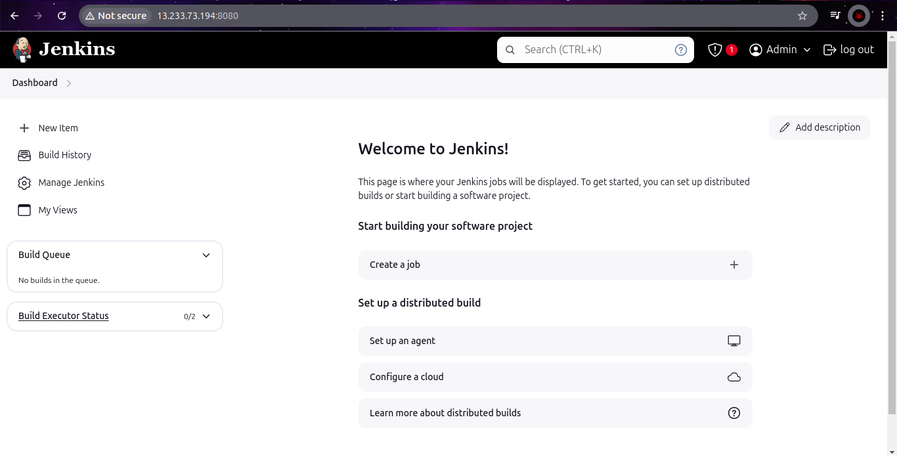

### 3.Create New Project ###

- Goto **Dashboard → New Item**.

- Enter the project name (e.g., **first-project**).

- Select a project type (e.g., **Freestyle Project**, **Pipeline**, **Multi Branch Pipeline**).

- Click **OK**.

- Configure the **Pipeline** project with **Checkout**, **Build**, **Test** & **Deploy** stages.

  ```Jenkinsfile
  pipeline {
      agent any
      stages {
          stage('Checkout') {
              steps {
                  echo 'Cloning...'
              }
          }
          stage('Build') {
              steps {
                  echo 'Building...'
              }
          }
          stage('Test') {
              steps {
                  echo 'Testing...'
              }
          }
          stage('Deploy') {
              steps {
                  echo 'Deploying...'
              }
          }
      }
  }
  ```


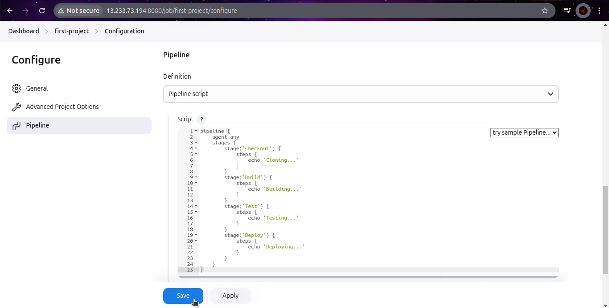

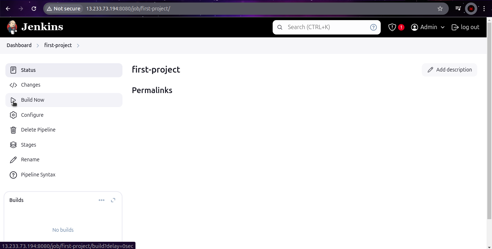

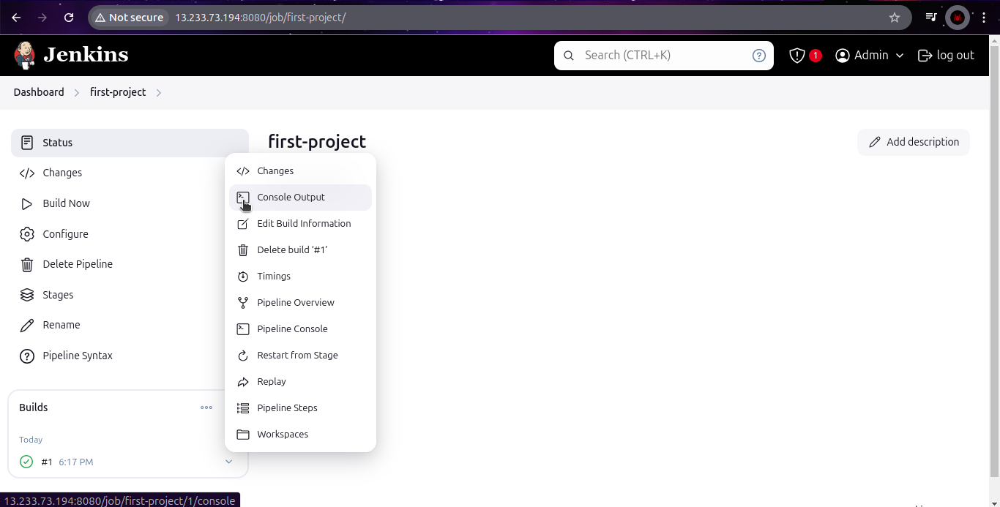

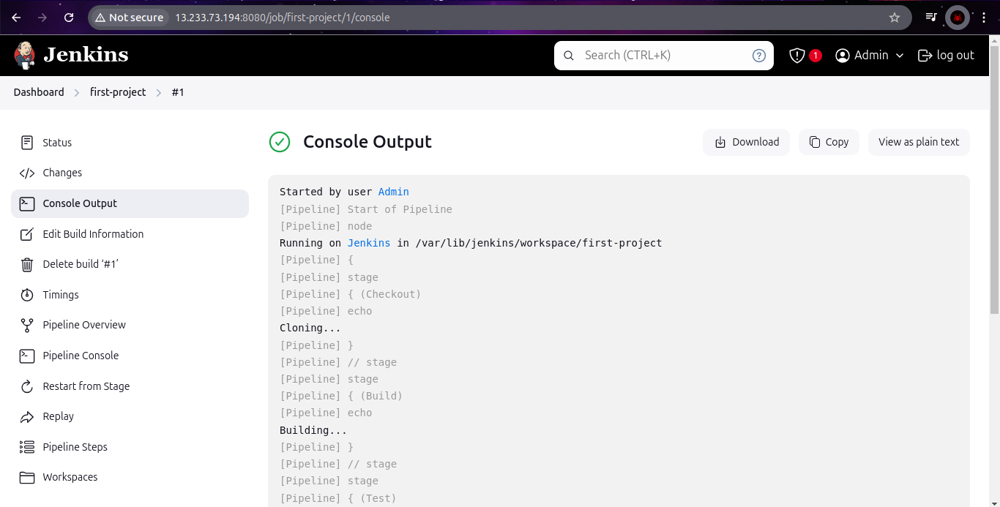

### 4. Create Users ###

- Goto **Manage Jenkins → Users**

- Click **Create User** and fill in the details (**username**, **password**, **email**, etc.)

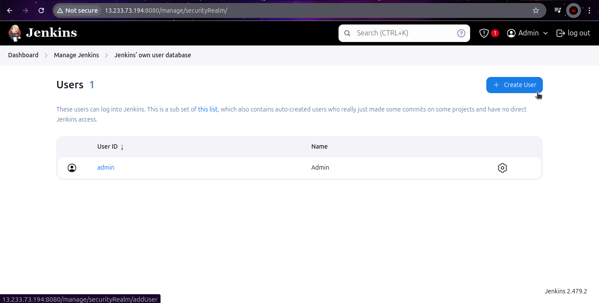

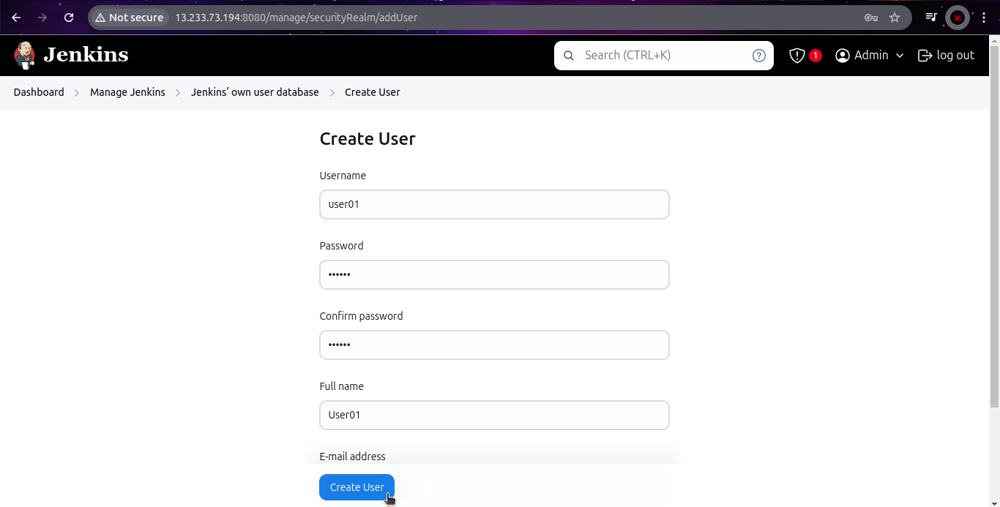

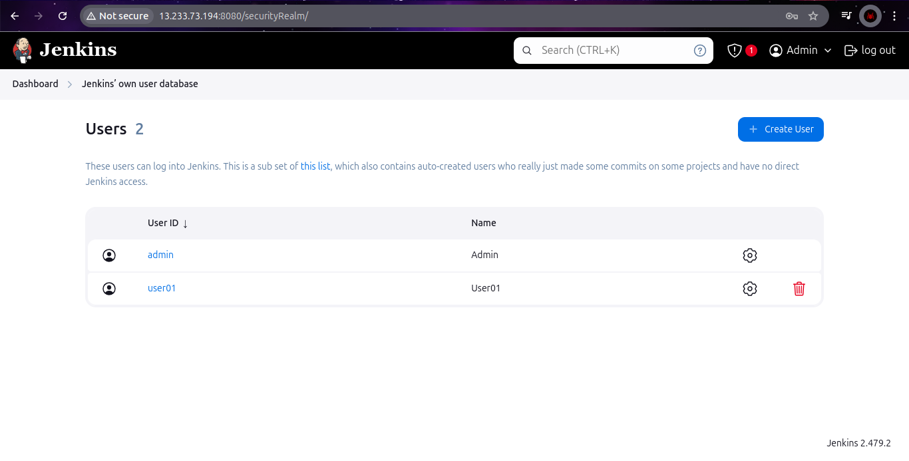
