# 10. Jenkins Task 2 #

## Instructions ##

### 1. Create a Script File & Push it to a New Repository ###

> script.sh

```bash
#!/bin/bash

echo "Hello, Jenkins! The script ran successfully on $(date)." > output.txt
echo "This is build number: ${BUILD_NUMBER}" >> output.txt
```

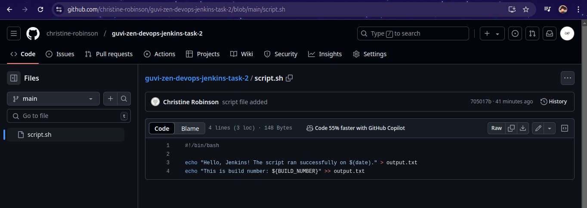

### 2. Github Webhook Setup with the Jenkins Server ###

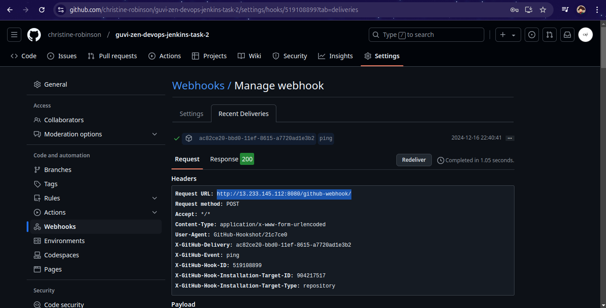

### 3. Configure SMTP on Jenkins & Send Test Email ###

> **Note:** It requires **App Password** from Gmail Account for SMTP Authentication

- **Step 1:** Goto **Manage Jenkins -> System -> Extended E-mail Notification**

- **Step 2:** Configure SMTP Server with the Gmail Credentials in the Advanced Section

  - **SMTP Server:** smtp.gmail.com

  - **SMTP Port:** 465 (when_ssl_enabled) / 587 (when_tls_enabled)

  - Create a **Username and Password** Credential in Jenkins (**Email ID** as Username & **App Password** as Password)

  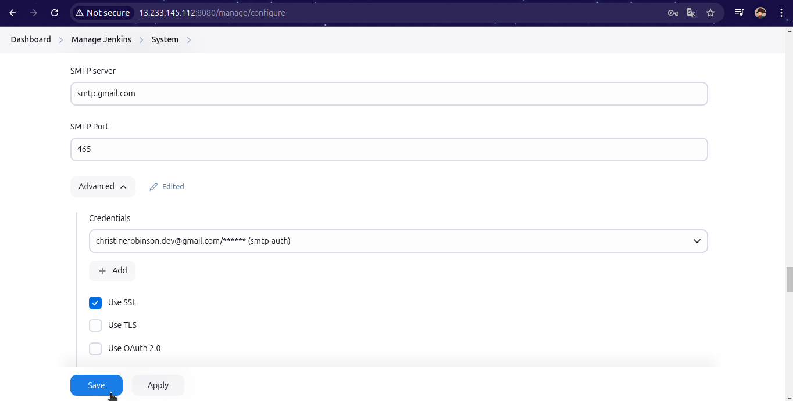

- **Step 3:** Goto **Manage Jenkins -> System -> E-mail Notification**

  - Test connection

  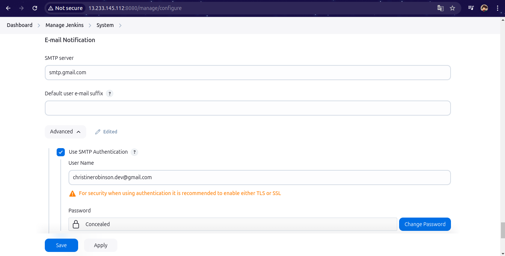

  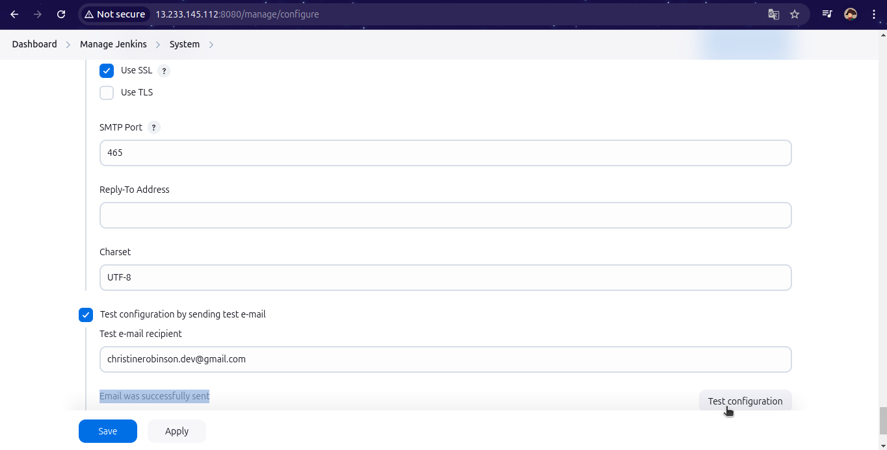

  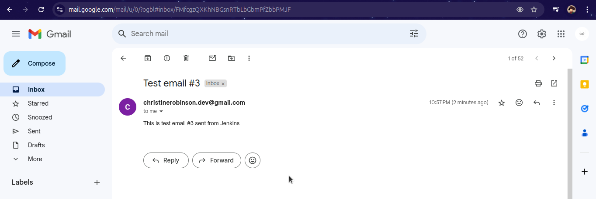

### 4. Create, Configure & Run the Pipeline Job ###

```Jenkinsfile
pipeline {
    agent any
    
    triggers {
        githubPush()
    }
    
    stages {
        stage('Checkout')  {
            steps {
                checkout scmGit(
                    branches: [[name: '*/main']], 
                    extensions: [], 
                    userRemoteConfigs: [[url: 'https://github.com/christine-robinson/guvi-zen-devops-jenkins-task-2.git']]
                )
            }
        }
        stage('Run Script') {
            steps {
                sh 'chmod +x ./script.sh'
                sh './script.sh'
            }
        }
    }
    
    post {
        success {
            emailext (
                recipientProviders: [requestor()],
                to: 'christinerobinson.dev@gmail.com',
                subject: "Build Successful: ${env.JOB_NAME} #${env.BUILD_NUMBER}",
                body: """
                The build for ${env.JOB_NAME} #${env.BUILD_NUMBER} was successful.
                
                Please find the build log attached for more details.
                
                Regards,
                Jenkins
                """,
                attachLog: true
            )
        }
    }
}
```

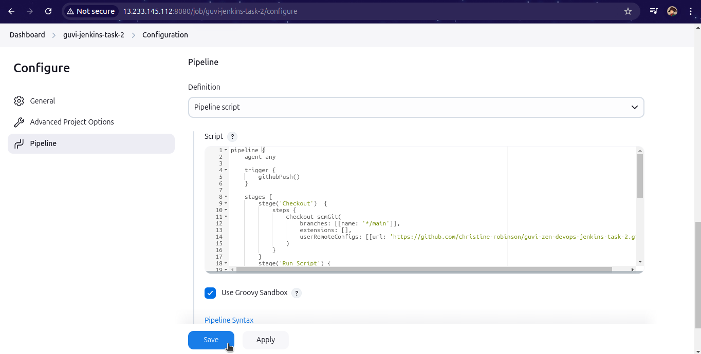

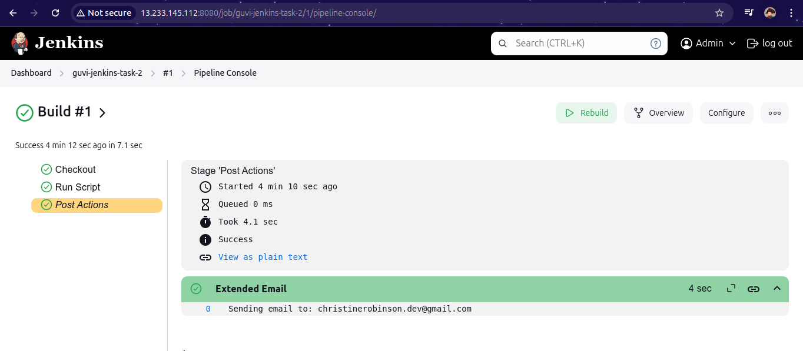

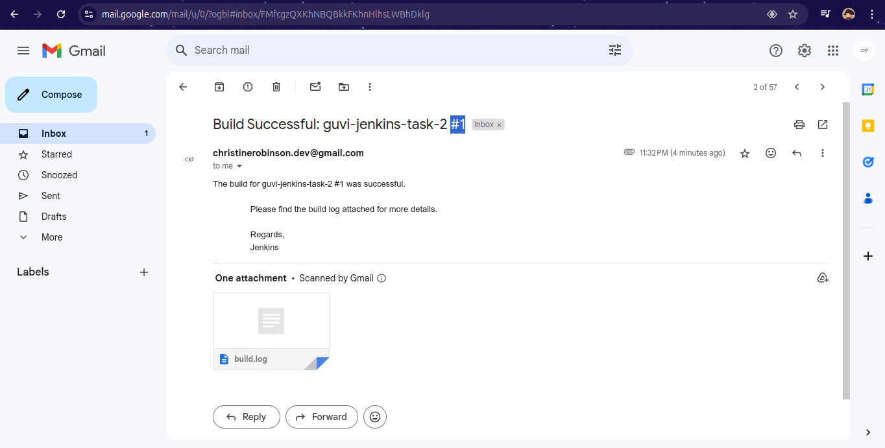

### 5. Update the Script File & Push it to the Repository to Test the Github Webhook ###

> script.sh

```bash
#!/bin/bash

echo "Hello, Jenkins! The script ran successfully on $(date)." > output.txt
echo "This is build number: ${BUILD_NUMBER}" >> output.txt

# Updated Content
cat output.txt
```

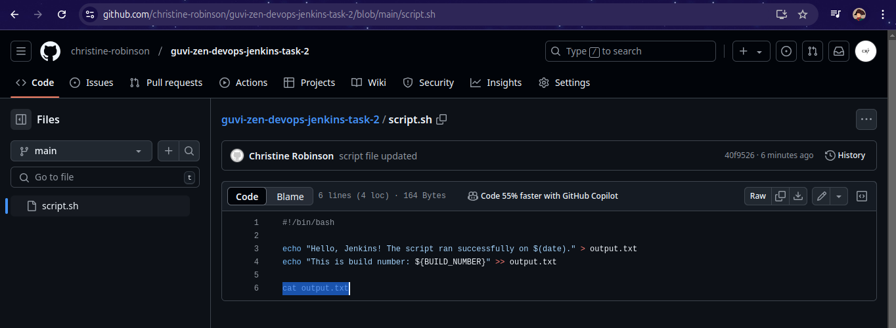

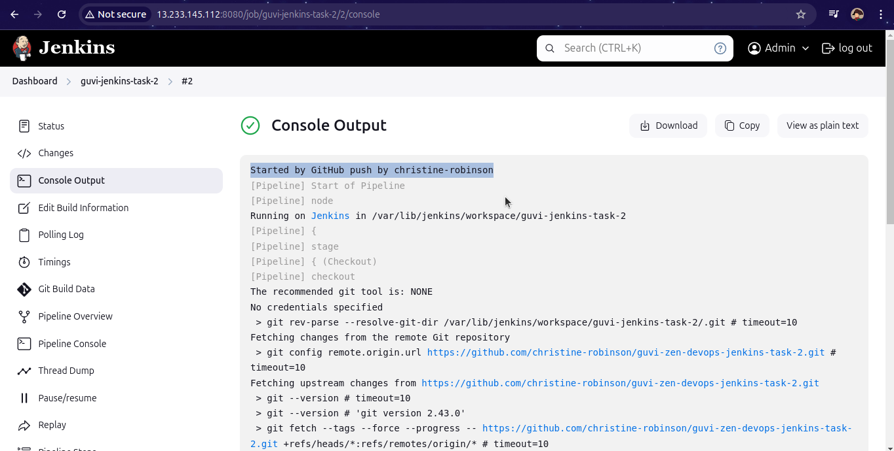


