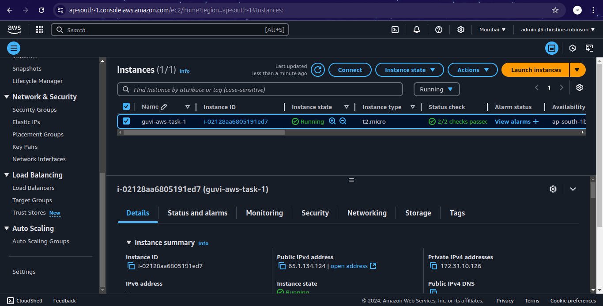
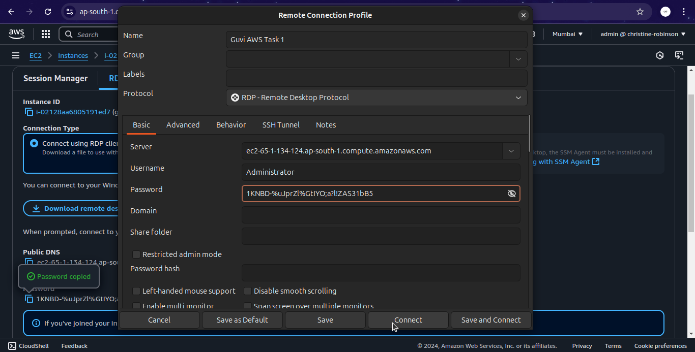
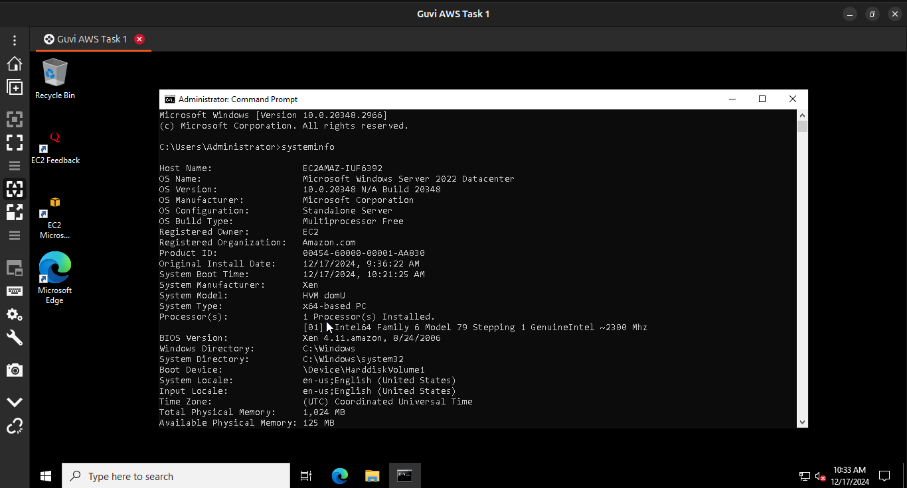

# 11. AWS Task 1 #

## Instructions ##

### 1. Create an EC2 Instance with Windows AMI ###

### 2. Get the connection details of Windows Server ###

### 3. Connect the Windows Server via Remmina's RDP Connection ###

