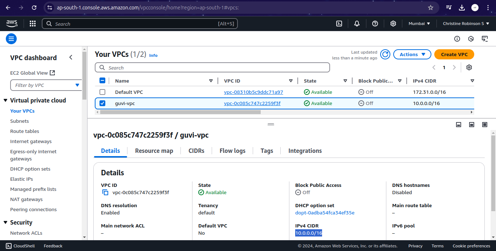
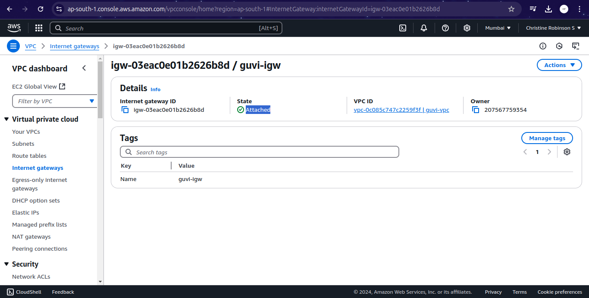
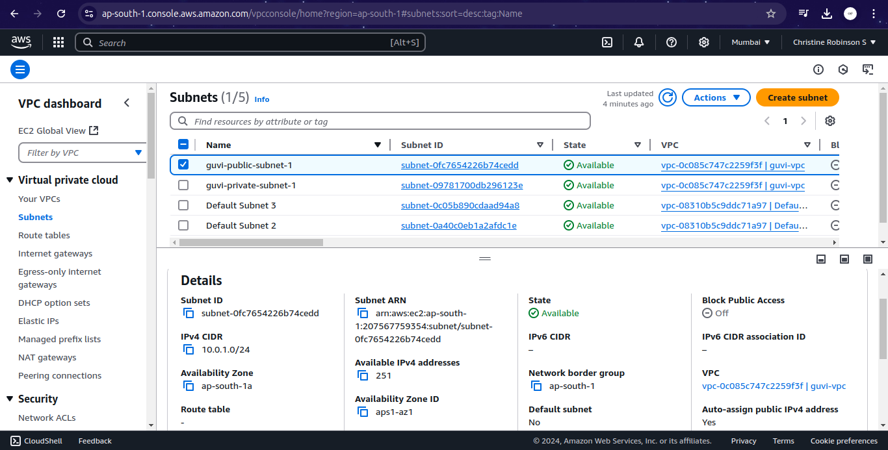
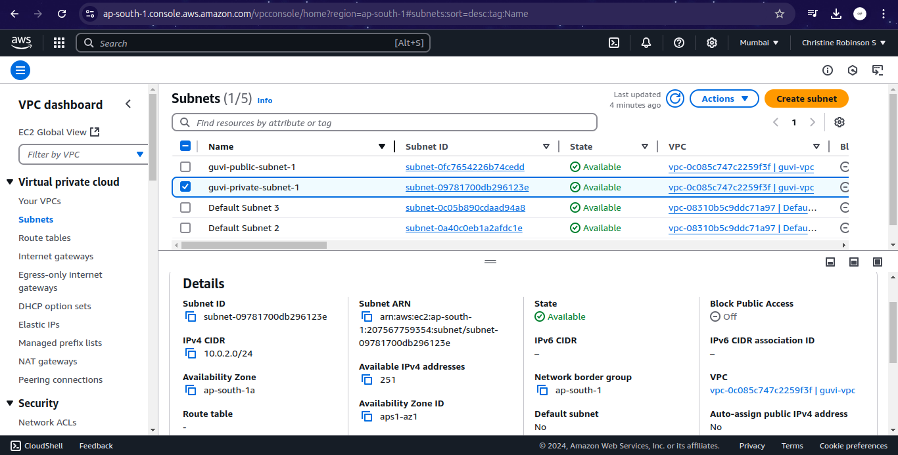
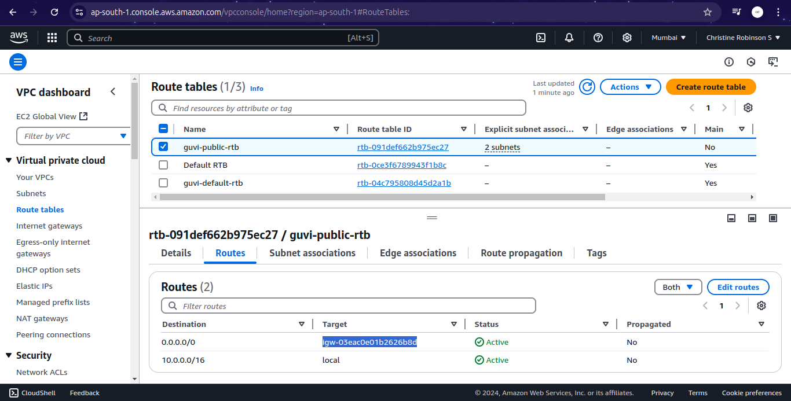
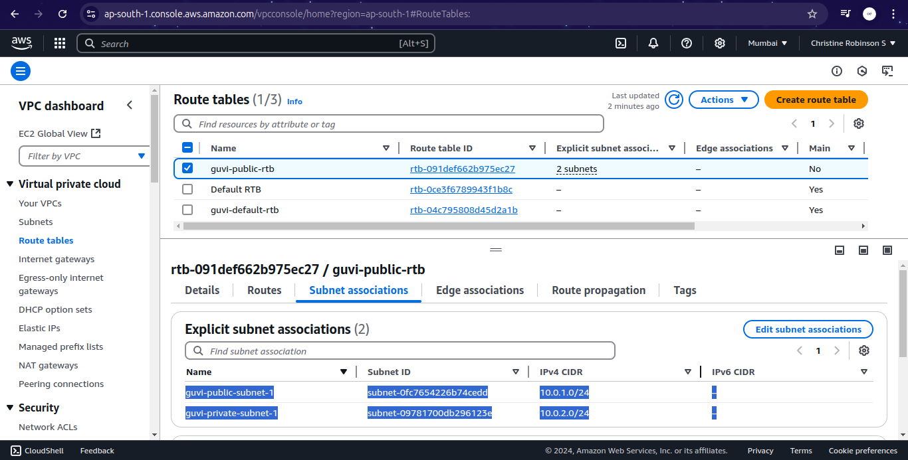
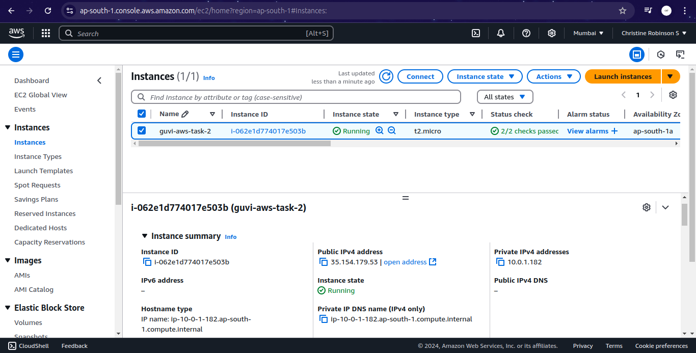
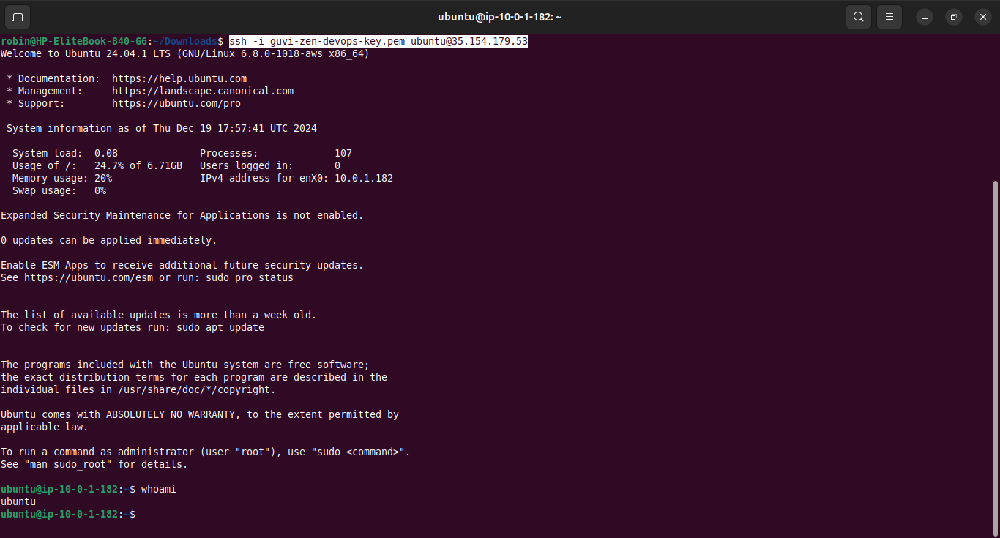

# AWS Task 2 #

## Instructions ##

### 1. Create a VPC ###

### 2. Create an Internet Gateway and Attach it to the VPC ###

### 3. Create a Public Subnet and a Private Subnet in the VPC ###

> **Note:** Provide Auto Assign IP only for the Public Subnet

### 4. Create a Route Table and Connect the Internet Gateway with those Subnets ###

### 5. Create an EC2 Instance with in the new VPC and Connect that via SSH ###

