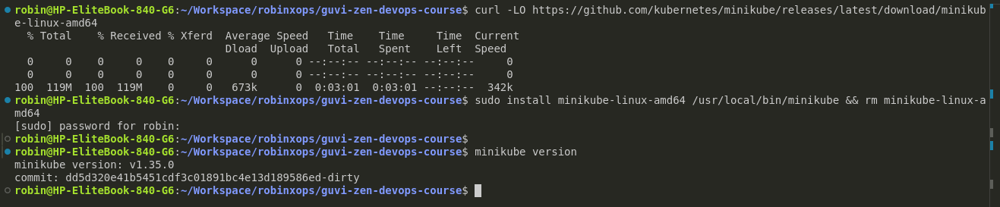
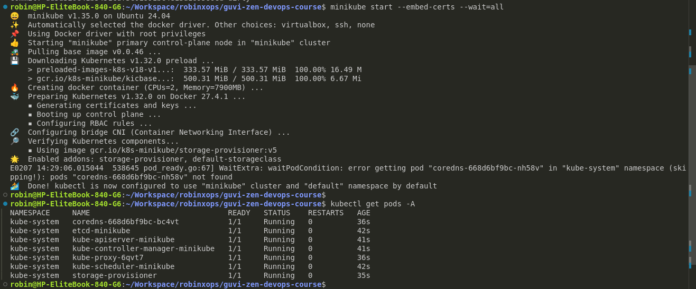
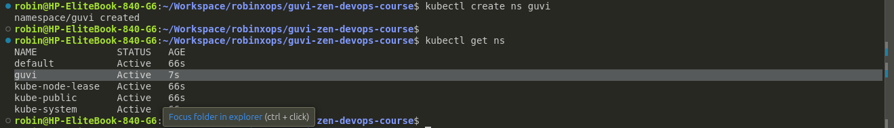

# 16. Kubernetes Task #

## Task 2: Instructions ##

**Step 1:** Install minikube & Install kubectl

```bash
curl -LO https://github.com/kubernetes/minikube/releases/latest/download/minikube-linux-amd64
sudo install minikube-linux-amd64 /usr/local/bin/minikube && rm minikube-linux-amd64

# Check the Installed Version
minikube version
```



**Step 2:** Create a kubernetes cluster by Minikube

```bash
minikube start --embed-certs --wait=all

# List all pods from all namespaces
kubectl get pods -A
```



**Step 3:** Create a Namespace

```bash
kubectl create ns guvi

# List all namespaces
kubectl get ns
```


