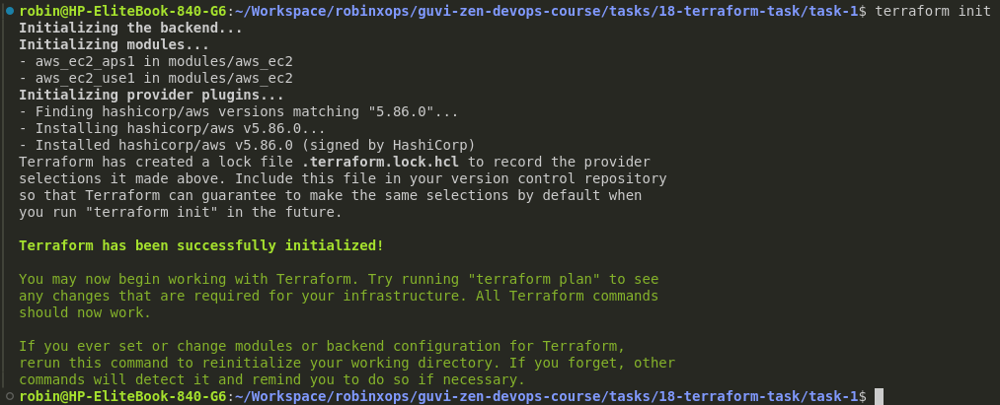
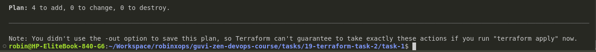
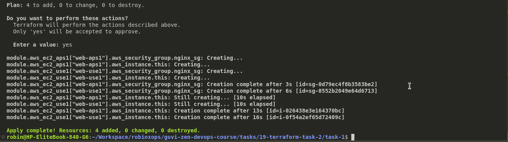
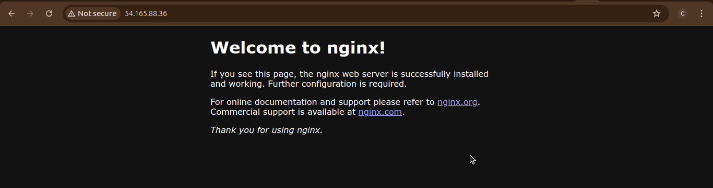
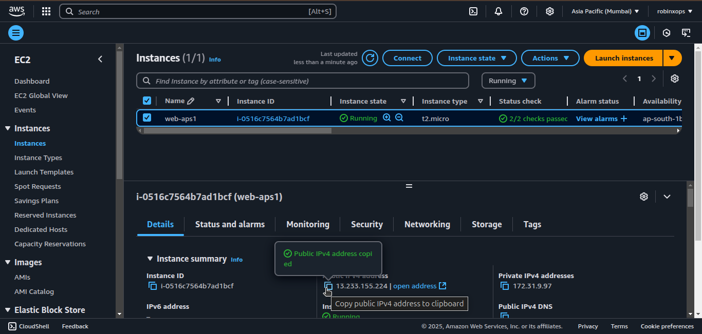
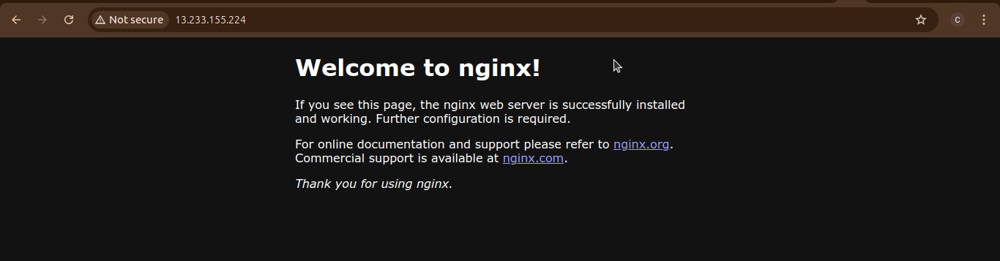

# 19. Terraform Task 2 #

## Instructions ##

### 1. Terraform Init ##

```bash
terraform init
```



### 2. Terraform Plan ###

```bash
terraform plan
```



### 3. Terraform Apply ###

```bash
terraform apply
```



### 4. Verify that by opening IP address EC2 instances on browser ###






