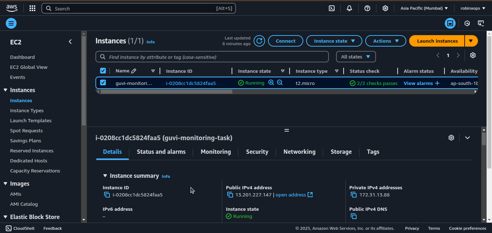
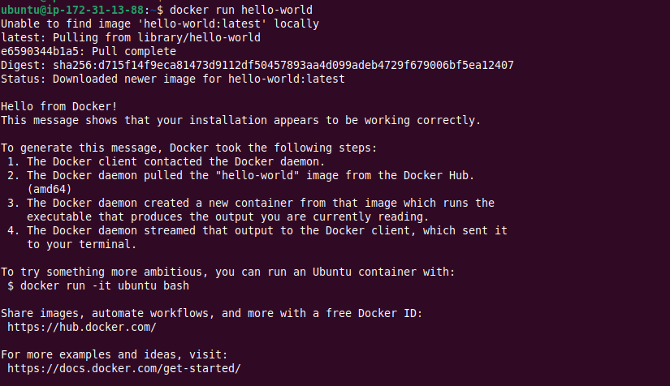
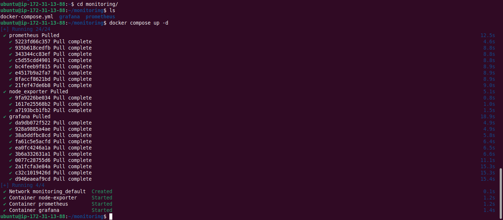
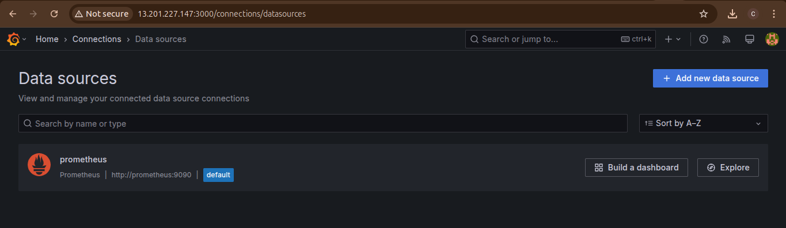

# 20. Monitoring Task #

## Instructions ##

### 1. Launch an EC2 Instance ###

> Note: Add Port 3000 in inbound rules of the instance's security group rules to view Grafana on browser



### 2. Install Docker Engine on the EC2 Instance ###

> ***Ref:*** [https://docs.docker.com/engine/install/ubuntu/#install-using-the-repository](https://docs.docker.com/engine/install/ubuntu/#install-using-the-repository)

```bash
# Add Docker's official GPG key:
sudo apt-get update
sudo apt-get install -y ca-certificates curl
sudo install -m 0755 -d /etc/apt/keyrings
sudo curl -fsSL https://download.docker.com/linux/ubuntu/gpg -o /etc/apt/keyrings/docker.asc
sudo chmod a+r /etc/apt/keyrings/docker.asc

# Add the repository to Apt sources:
echo \
  deb [arch=$(dpkg --print-architecture) signed-by=/etc/apt/keyrings/docker.asc] https://download.docker.com/linux/ubuntu \
  $(. /etc/os-release && echo $VERSION_CODENAME) stable | \
  sudo tee /etc/apt/sources.list.d/docker.list > /dev/null

sudo apt-get update

# Install the Docker packages
sudo apt-get install -y docker-ce docker-ce-cli containerd.io docker-buildx-plugin docker-compose-plugin

# Add the current user to the docker group, so you can run Docker commands without sudo.
sudo usermod -aG docker $USER

# Reboot the instance
sudo reboot
```

### 3. Verify the Docker Installation ###

```bash
docker run hello-world
```



### 4. Create Configuration files for Prometheus & Grafana ###

> monitoring/prometheus/prometheus.yml

```yml
global:
  scrape_interval: 15s

scrape_configs:
  - job_name: "node-exporter"
    static_configs:
      - targets: ["node_exporter:9100"]
```

> monitoring/grafana/provisioning/datasources/datasource.yaml

```yaml
# For configuration options, see 
#   https://grafana.com/docs/grafana/latest/administration/provisioning/#example-data-source-config-file

apiVersion: 1

datasources:
  - name: prometheus
    type: prometheus
    access: proxy
    orgId: 1
    uid: default_prometheus_ds
    url: http://prometheus:9090
    basicAuth: false
    isDefault: true
    jsonData:
      timeInterval: 15s
      tlsAuth: false
      tlsAuthWithCACert: false
```

> monitoring/grafana/provisioning/dashboards/dashboard.yaml

```yaml
apiVersion: 1

providers:
  - name: Default
    type: file
    disableDeletion: false
    updateIntervalSeconds: 10
    editable: true
    options:
      path: /etc/grafana/provisioning/dashboards/definitions
```

> monitoring/grafana/provisioning/dashboards/definitions/node-exporter.json

```bash
cd grafana/provisioning/dashboards/definitions/
wget -O node-exporter.json https://grafana.com/api/dashboards/1860/revisions/37/download
```

### 5. Create Docker Compose file to Install Grafana, Prometheus, Node Exporter ###

> monitoring/docker-compose.yml

```yml
services:
  prometheus:
    image: prom/prometheus:latest
    container_name: prometheus
    volumes:
      - ./prometheus/prometheus.yml:/etc/prometheus/prometheus.yml
    ports:
      - 9090:9090

  node_exporter:
    image: prom/node-exporter:latest
    container_name: node-exporter
    ports:
      - 9100:9100

  grafana:
    image: grafana/grafana:latest
    container_name: grafana
    environment:
      - GF_SECURITY_ADMIN_PASSWORD=admin
    volumes:
      - ./grafana/provisioning:/etc/grafana/provisioning/:ro
    ports:
      - 3000:3000
    depends_on:
      - prometheus
```

### 6. Run Docker Compose ###

```bash
cd monitoring

docker compose up -d
```



